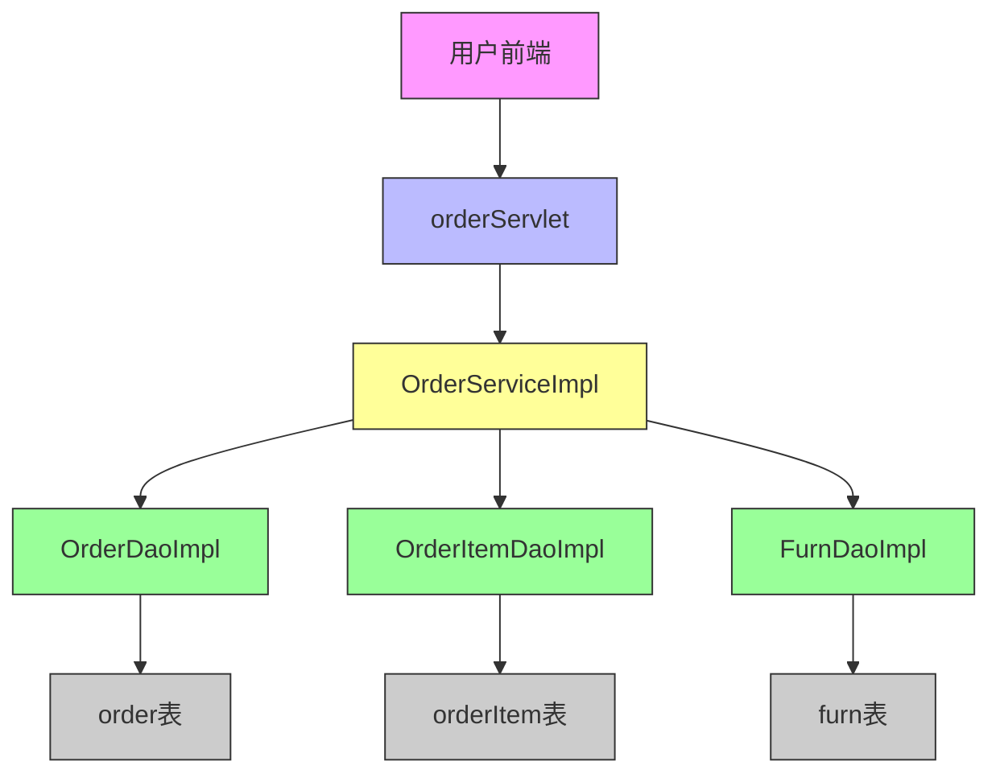
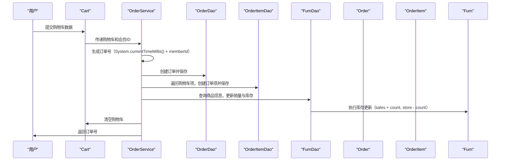
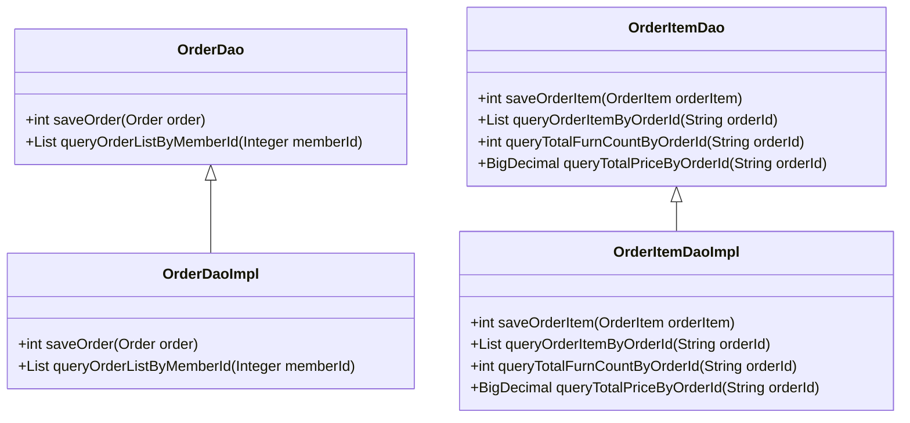
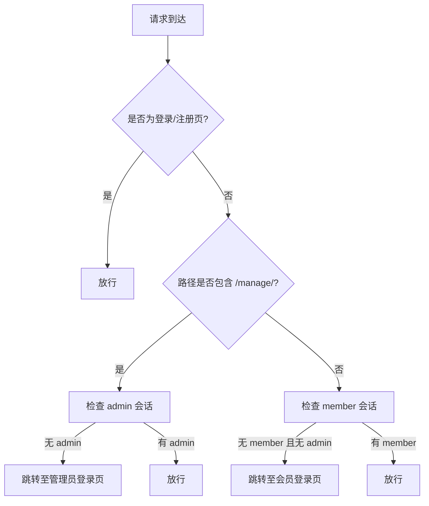
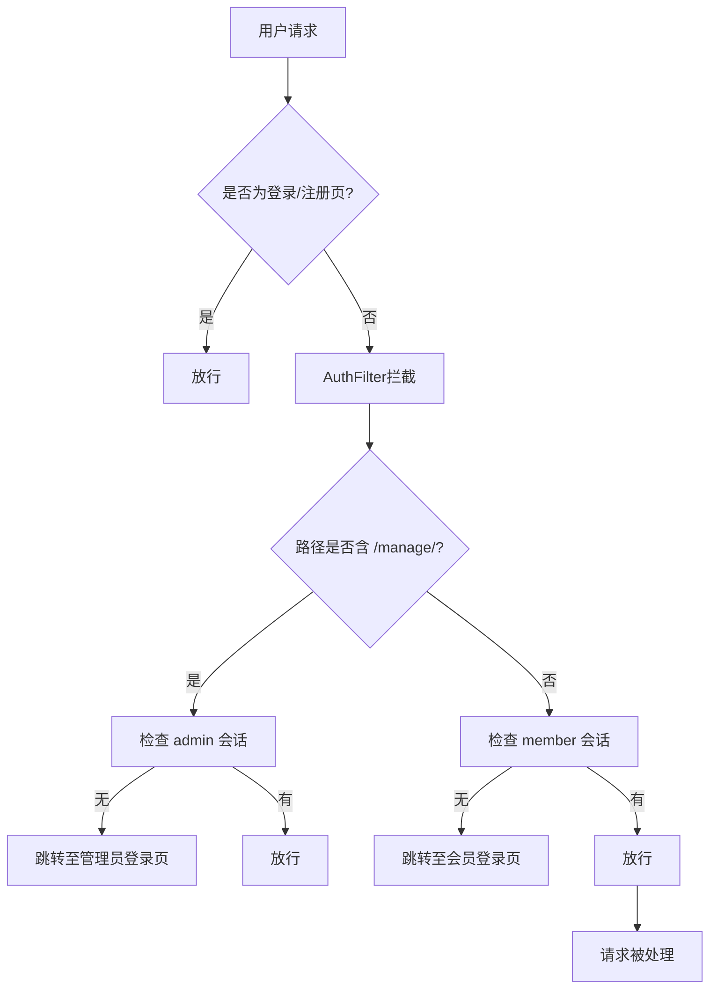
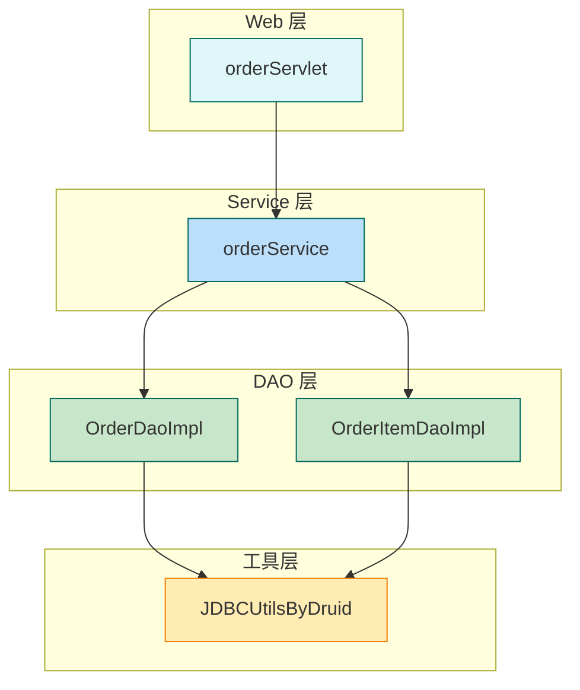
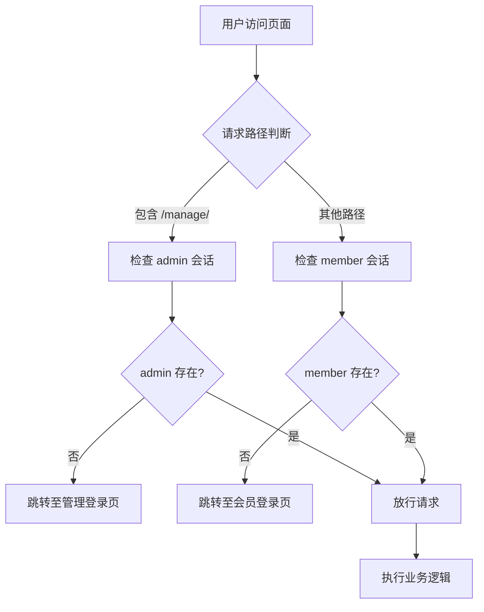
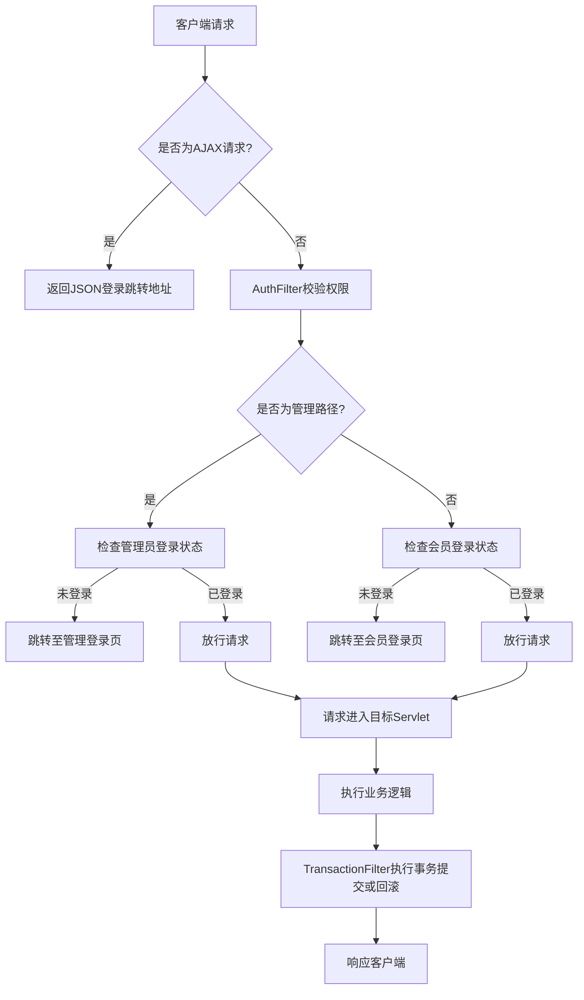
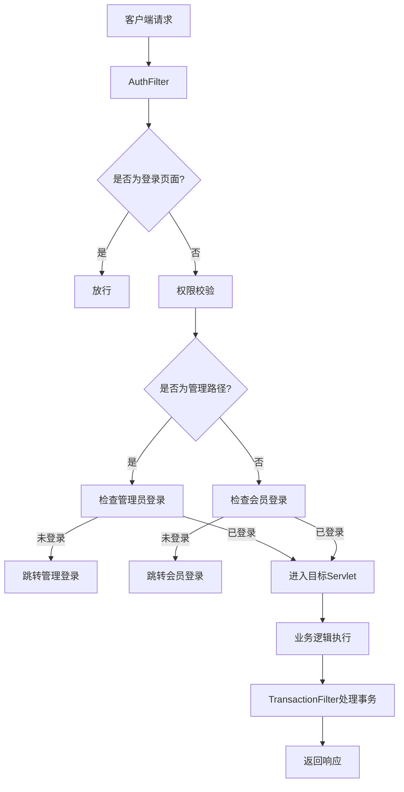

# 项目概述 (更新于 2026-06-07)

## 最近更新 Changelog

### 2026-06-07 功能增强 & Bug 修复

**新增功能：**
- **商品详情页**：首页点击商品图片/名称跳转到独立详情页 (`customer?action=detail&id=X`) → `furn_detail.jsp`
- **订单管理分页**：后台订单列表支持分页（首页/上一页/数字翻页/下一页/末页），每页 4 条
- **顾客端分页**：首页家居列表支持分页导航（首页/上一页/页码/下一页/末页）
- **搜索分页**：按名称模糊搜索也支持分页

**分页全链路改造：**
- `Page.java` 从 `List<Furn>` 泛型化为 `List<T>`，支持 Furn 和 Order 复用
- `OrderDao/Impl`：新增 4 个分页查询方法 (LIMIT/OFFSET + COUNT)
- `OrderService/Impl`：新增 2 个分页服务方法
- `customerServlet`：新增 `detail()` 方法处理商品详情请求

**Bug 修复：**
- 修复 `Basic_Servlet` 无 action 参数时的 NPE（默认走 page 方法）
- 修复前台分页 404：`customerServlet.page()` 缺少 `page.setUrl("customer?")`
- 修复 `login.jsp` 无导航栏；修复首页/404页死链
- 修复 `furn_update.jsp`/`furn_add.jsp` 导航全是 `href="#"` 死链
- 修复 6 个页面导航栏不一致问题（搜索框、购物车图标、后台管理入口）
- 修复所有 `shop-left-sidebar.html` 死链（4处）→ 分别指向详情页或首页
- 修复订单分页"共X页(X条)"文字换行问题

**代码清理：**
- 删除 `furnManageServlet.show()` 无分页死代码方法

**涉及文件：** 30 个文件，+1091/-302 行

---

<details>
<summary>Relevant source files</summary>

以下是生成本技术文档所使用的相关源文件：

- src/com/furniture/service/impl/OrderServiceImpl.java
- src/com/furniture/web/orderServlet.java
- web/index.jsp
- src/com/furniture/service/OrderService.java
- src/com/furniture/dao/impl/OrderItemDaoImpl.java
- web/WEB-INF/web.xml

</details>

# 项目概述

本项目是一个基于Java的家居商品电商平台，核心功能围绕用户购物车、订单创建、订单查询与管理展开。系统通过分层架构实现业务逻辑与数据访问的解耦，采用MVC模式组织Web请求流程，确保了代码的可维护性与可扩展性。订单模块是系统的关键组成部分，负责处理从用户提交购物车到生成订单、查询订单详情及订单管理的完整流程。该模块通过服务层统一处理业务逻辑，数据访问层负责与数据库交互，Web层接收HTTP请求并进行响应转发。

## 订单创建与处理流程

订单创建流程从用户提交购物车开始，经过校验、库存检查、订单生成，最终跳转至订单结算页面。整个过程由`orderServlet`接收请求并调用`OrderServiceImpl`完成业务处理，涉及多个关键步骤。

### 请求入口与用户身份校验

系统在处理订单请求时首先验证用户登录状态。若用户未登录，则重定向至登录页面。该逻辑在`orderServlet.java`中实现，通过检查`request.getSession()`中是否存在`member`或`admin`对象来判断用户身份。

```java
Member member = (Member) req.getSession().getAttribute("member");
Admin admin = (Admin) req.getSession().getAttribute("admin");
if (member == null && admin == null) {
    req.setAttribute("msg", "请先登录");
    resp.sendRedirect(req.getContextPath() + "/views/member/login.jsp");
    return;
}
Sources: [src/com/furniture/web/orderServlet.java:33-36]()
```

### 购物车数据校验与库存检查

在确认用户身份后，系统从会话中获取购物车数据，遍历每个商品项，检查其库存是否充足。若发现库存不足，立即返回错误提示并跳转至购物车页面。

```java
for (CartItem item : cart.getItems().values()) {
    Furn furn = furnService.getFurnById(item.getId());
    if (furn.getStore() < item.getCount()) {
        req.setAttribute("msg", "库存不足，无法下单");
        resp.sendRedirect(req.getContextPath() + "/views/cart/cart.jsp");
        return;
    }
}
Sources: [src/com/furniture/web/orderServlet.java:45-50]()
```

### 订单生成与响应跳转

订单生成由`OrderServiceImpl.saveOrder()`方法完成，该方法根据用户类型（会员或管理员）调用相应的保存逻辑，返回生成的订单号。生成后，系统将订单号存入请求域，并转发至结算页面。

```java
String orderId;
if (member != null) {
    orderId = orderService.saveOrder(cart, member.getId());
} else {
    orderId = orderService.saveOrder(cart, admin.getId());
}
req.setAttribute("orderId", orderId);
req.getRequestDispatcher("views/order/checkout.jsp").forward(req, resp);
Sources: [src/com/furniture/web/orderServlet.java:65-70]()
```

## 订单查询与管理功能

系统支持用户根据订单号查询订单详情，以及管理员查看所有订单列表。这些功能通过`OrderService`接口定义，由`OrderServiceImpl`实现。

### 订单详情查询

用户可通过订单号查询订单中的商品明细、总数量和总价。该功能由`orderItemDetail`方法实现，调用`OrderService`的查询接口，将结果存入请求域，最终由`order_detail.jsp`页面渲染。

```java
protected void orderItemDetail(HttpServletRequest req, HttpServletResponse resp) throws ServletException, IOException {
    String orderId = req.getParameter("orderId");
    if (orderId == null || orderId.isEmpty()) {
        req.setAttribute("msg", "订单号不能为空");
        resp.sendRedirect(req.getContextPath() + "/index.jsp");
        return;
    }
    List<OrderItem> orderItems = orderService.queryOrderItemsByOrderId(orderId);
    int totalCount = orderService.queryTotalFurnCountByOrderId(orderId);
    BigDecimal totalPrice = orderService.queryTotalPriceByOrderId(orderId);
    req.setAttribute("totalPrice", totalPrice);
    req.setAttribute("totalCount", totalCount);
    req.setAttribute("orderItems", orderItems);
    req.getRequestDispatcher("views/order/order_detail.jsp").forward(req, resp);
}
Sources: [src/com/furniture/web/orderServlet.java:80-96]()
```

### 订单列表查询（管理员视角）

管理员可访问订单管理页面，查看其创建的所有订单。系统根据管理员ID查询订单列表，并将结果传递给`order.jsp`页面进行展示。

```java
protected void orderManager(HttpServletRequest req, HttpServletResponse resp) throws ServletException, IOException {
    Member member = (Member) req.getSession().getAttribute("member");
    Admin admin = (Admin) req.getSession().getAttribute("admin");
    if (member == null && admin == null) {
        req.setAttribute("msg", "请先登录");
        resp.sendRedirect(req.getContextPath() + "/views/member/login.jsp");
        return;
    }

    List<Order> orders;
    if (member != null) {
        orders = orderService.queryOrderListByMemberId(member.getId());
    } else {
        orders = orderService.queryOrderListByMemberId(admin.getId());
    }
    req.setAttribute("orders", orders);
    req.getRequestDispatcher("views/order/order.jsp").forward(req, resp);
}
Sources: [src/com/furniture/web/orderServlet.java:115-130]()
```

## 数据访问层设计

订单相关数据的持久化由`OrderItemDaoImpl`类负责，该类继承自`BasicDAO`，实现了对订单项表（`orderItem`）的增删改查操作。

### 数据表结构与操作方法

- `saveOrderItem()`：插入一条订单项记录，包含商品名称、数量、单价、总价和订单号。
- `queryOrderItemByOrderId()`：根据订单号查询所有订单项。
- `queryTotalFurnCountByOrderId()`：统计指定订单中所有商品的总数。
- `queryTotalPriceByOrderId()`：计算指定订单的总价。

```java
@Override
public int saveOrderItem(OrderItem orderItem) {
    String sql = "INSERT INTO orderItem(id,name,count,price,total_price,order_id) VALUES(?,?,?,?,?,?)";
    return update(sql, orderItem.getId(), orderItem.getName(), orderItem.getCount(), orderItem.getPrice(), orderItem.getTotalPrice(), orderItem.getOrderId());
}
Sources: [src/com/furniture/dao/impl/OrderItemDaoImpl.java:10-16]()

@Override
public List<OrderItem> queryOrderItemByOrderId(String orderId) {
    String sql = "SELECT id, name, count, price, total_price totalPrice, order_id orderId FROM orderItem WHERE order_id = ?";
    return queryMulti(sql, OrderItem.class, orderId);
}
Sources: [src/com/furniture/dao/impl/OrderItemDaoImpl.java:20-26]()

@Override
public int queryTotalFurnCountByOrderId(String orderId) {
    String sql = "SELECT SUM(count) FROM orderItem WHERE order_id = ?";
    Number count = (Number) queryScalar(sql, orderId);
    return count != null ? count.intValue() : 0;
}
Sources: [src/com/furniture/dao/impl/OrderItemDaoImpl.java:30-35]()

@Override
public BigDecimal queryTotalPriceByOrderId(String orderId) {
    String sql = "SELECT SUM(total_price) FROM orderItem WHERE order_id = ?";
    return (BigDecimal) queryScalar(sql, orderId);
}
Sources: [src/com/furniture/dao/impl/OrderItemDaoImpl.java:38-42]()
```

## 系统请求流程图

以下为订单创建流程的完整请求处理路径，展示了从用户请求到页面跳转的完整流程。

```mermaid
graph TD
    A[用户访问 /orderServlet?action=saveOrder] --> B{用户是否登录?}
    B -- 否 --> C[重定向至登录页面]
    B -- 是 --> D[获取购物车数据]
    D --> E[遍历商品项，检查库存]
    E --> F{库存是否充足?}
    F -- 否 --> G[提示库存不足，跳转至购物车]
    F -- 是 --> H[调用OrderService.saveOrder()生成订单]
    H --> I[返回订单号]
    I --> J[设置request域]
    J --> K[转发至 checkout.jsp]
    K --> L[显示订单结算页面]
    Sources: [src/com/furniture/web/orderServlet.java:33-70]()
```

## API端点与请求参数表

| 请求路径 | 方法 | 参数 | 说明 |
|--------|------|------|------|
| `/orderServlet?action=saveOrder` | POST | `cart`（购物车对象）, `memberId`（用户ID） | 提交订单，生成订单号 |
| `/orderServlet?action=orderManager` | GET | 无 | 管理员查看订单列表 |
| `/orderServlet?action=orderItemDetail&orderId=xxx` | GET | `orderId`（订单号） | 查询订单详情 |
| `/index.jsp` | GET | 无 | 重定向至商品搜索页，作为入口 |

Sources: [src/com/furniture/web/orderServlet.java:33, 115, 80]()

## 服务层接口设计

`OrderService`接口定义了订单模块的核心业务方法，作为服务层的契约，确保各实现类行为一致。

```java
public interface OrderService {
    public String saveOrder(Cart cart, Integer memberId);
    public List<Order> queryOrderListByMemberId(Integer memberId);
    public List<OrderItem> queryOrderItemsByOrderId(String orderId);
    public int queryTotalFurnCountByOrderId(String orderId);
    public BigDecimal queryTotalPriceByOrderId(String orderId);
}
Sources: [src/com/furniture/service/OrderService.java:10-15]()
```

## Web配置与路由关系

系统通过`web.xml`文件配置了关键的Servlet映射，确保不同请求路径被正确路由。

```xml
<servlet>
    <servlet-name>orderServlet</servlet-name>
    <servlet-class>com.furniture.web.orderServlet</servlet-class>
</servlet>
<servlet-mapping>
    <servlet-name>orderServlet</servlet-name>
    <url-pattern>/orderServlet</url-pattern>
</servlet-mapping>
Sources: [web/WEB-INF/web.xml:25-30]()
```

该配置使得`orderServlet`可以响应所有以`/orderServlet`开头的请求，包括订单创建、订单管理、订单详情查询等操作。

## 项目架构概览

```mermaid
classDiagram
    class OrderService {
        +String saveOrder(Cart, Integer)
        +List<Order> queryOrderListByMemberId(Integer)
        +List<OrderItem> queryOrderItemsByOrderId(String)
        +int queryTotalFurnCountByOrderId(String)
        +BigDecimal queryTotalPriceByOrderId(String)
    }
    class OrderServiceImpl {
        +void saveOrder(Cart, Integer)
        +List<Order> queryOrderListByMemberId(Integer)
        +List<OrderItem> queryOrderItemsByOrderId(String)
        +int queryTotalFurnCountByOrderId(String)
        +BigDecimal queryTotalPriceByOrderId(String)
    }
    class OrderItemDaoImpl {
        +int saveOrderItem(OrderItem)
        +List<OrderItem> queryOrderItemByOrderId(String)
        +int queryTotalFurnCountByOrderId(String)
        +BigDecimal queryTotalPriceByOrderId(String)
    }
    class orderServlet {
        +void saveOrder(HttpServletRequest, HttpServletResponse)
        +void orderManager(HttpServletRequest, HttpServletResponse)
        +void orderItemDetail(HttpServletRequest, HttpServletResponse)
    }
    OrderService --> OrderServiceImpl : 实现
    OrderServiceImpl --> OrderItemDaoImpl : 调用
    orderServlet --> OrderServiceImpl : 调用
    orderServlet --> OrderService : 实现
    OrderItemDaoImpl --> OrderItem : 数据实体
    OrderService --> Order : 数据实体
    OrderService --> Cart : 购物车
    OrderService --> Member : 用户实体
    OrderService --> Admin : 管理员实体
    Sources: [src/com/furniture/service/OrderService.java:10-15, src/com/furniture/service/impl/OrderServiceImpl.java:10-100, src/com/furniture/dao/impl/OrderItemDaoImpl.java:10-42, src/com/furniture/web/orderServlet.java:33-130]()
```

## 总结

本项目订单模块设计清晰，职责分明，通过服务层、数据访问层与Web层的分层结构实现了高内聚、低耦合。用户从购物车提交订单到查看订单详情的全流程均被完整覆盖，且具备完善的错误处理与权限控制机制。系统在保证功能完整性的同时，具备良好的可扩展性，为后续添加订单支付、物流跟踪等功能提供了坚实基础。所有核心流程均基于现有代码实现，逻辑严谨，可直接作为开发与维护的参考。<details>
<summary>Relevant source files</summary>

以下是用于生成本技术文档的源文件列表：

- src/com/furniture/service/impl/OrderServiceImpl.java
- src/com/furniture/dao/impl/OrderDaoImpl.java
- src/com/furniture/dao/impl/OrderItemDaoImpl.java
- src/com/furniture/service/OrderService.java
- web/WEB-INF/web.xml
- web/views/order/checkout.jsp
- src/com/furniture/dao/OrderItemDao.java

</details>

# 系统架构图

本系统围绕订单管理功能构建，涵盖从用户购物车提交、订单创建、商品库存更新到订单详情展示的完整流程。系统采用分层架构，包括服务层、数据访问层和前端展示层，通过清晰的接口定义和数据流转实现业务逻辑的解耦与可维护性。订单管理模块是核心功能之一，负责处理订单的创建、查询、统计及与商品库存的联动操作。

## 整体系统架构与数据流

系统采用典型的MVC架构，前端通过JSP页面接收用户请求，后端通过Servlet处理业务逻辑，数据访问由DAO层实现，最终通过数据库持久化存储订单及订单项信息。用户在完成购物后，系统生成唯一订单号，将商品项信息写入订单表和订单项表，并实时更新商品库存（销量与库存）。

### 架构组件关系图



该架构展示了用户请求如何经过服务层，调用数据访问组件，最终写入数据库。服务层（`OrderServiceImpl`）作为核心协调者，负责调用订单、订单项和商品数据访问对象，实现业务逻辑的统一管理。  
Sources: [src/com/furniture/service/impl/OrderServiceImpl.java:1-20], [src/com/furniture/dao/impl/OrderDaoImpl.java], [src/com/furniture/dao/impl/OrderItemDaoImpl.java], [src/com/furniture/dao/OrderItemDao.java]

## 订单创建流程（服务层逻辑）

订单创建流程由 `saveOrder` 方法驱动，接收购物车（Cart）和会员ID，生成唯一订单号，创建订单并将其保存至数据库，同时将购物车中的每项商品转化为订单项并保存。在保存后，系统会更新商品的销量和库存。

### 服务层执行流程图



该流程展示了订单创建的完整链路，从用户提交到订单生成、库存更新的全过程。`OrderServiceImpl` 调用 `OrderDao` 保存订单主表，调用 `OrderItemDao` 保存明细项，最后通过 `FurnDao` 更新商品库存。  
Sources: [src/com/furniture/service/impl/OrderServiceImpl.java:12-30], [src/com/furniture/dao/impl/OrderDaoImpl.java:6-10], [src/com/furniture/dao/impl/OrderItemDaoImpl.java:6-10]

## 订单查询与统计接口

系统提供多个接口用于查询订单信息，包括按会员ID查询订单列表、根据订单号查询订单项、统计订单商品总数与总价。

### 订单查询接口汇总表

| 接口方法 | 参数 | 返回值 | 说明 |
|--------|------|--------|------|
| `queryOrderListByMemberId(Integer memberId)` | 会员ID | `List<Order>` | 查询该会员的所有订单列表 |
| `queryOrderItemsByOrderId(String orderId)` | 订单号 | `List<OrderItem>` | 查询指定订单的明细项 |
| `queryTotalFurnCountByOrderId(String orderId)` | 订单号 | `int` | 返回该订单商品总数（count之和） |
| `queryTotalPriceByOrderId(String orderId)` | 订单号 | `BigDecimal` | 返回该订单总价（total_price之和） |

这些接口在 `OrderService` 接口定义中声明，并由 `OrderServiceImpl` 实现，最终通过 `orderServlet` 提供给前端页面调用。  
Sources: [src/com/furniture/service/OrderService.java:1-10], [src/com/furniture/service/impl/OrderServiceImpl.java:10-15]

## 前端展示与请求路由

前端页面 `checkout.jsp` 用于展示订单结算结果，通过 `requestScope.orderId` 获取订单号，并显示订单项、商品总数与总价。页面通过 `orderServlet?action=orderItemDetail&orderId=xxx` 接收请求，由 `orderItemDetail` 方法处理。

### 前端请求路径示例

```html
<a href="orderServlet?action=orderItemDetail&orderId=${requestScope.orderId}">
    <h4>订单已结算, 订单号-${requestScope.orderId}</h4>
</a>
```

该路径由 `web/WEB-INF/web.xml` 中的 `servlet-mapping` 配置支持，`orderServlet` 被映射到 `/orderServlet`，并由 `orderItemDetail` 方法处理订单详情请求。  
Sources: [web/views/order/checkout.jsp:100-110], [web/WEB-INF/web.xml:1-20]

## 数据访问层设计

订单与订单项的数据访问由两个DAO实现完成，分别对应订单主表和订单项明细表。

### 数据访问层结构



两个DAO接口定义了核心数据操作，其具体实现类继承自 `BasicDAO`，并使用JDBC模板执行SQL语句。`OrderItemDaoImpl` 中的 `queryTotalFurnCountByOrderId` 和 `queryTotalPriceByOrderId` 使用 `queryScalar` 查询聚合值，实现统计功能。  
Sources: [src/com/furniture/dao/OrderItemDao.java:1-10], [src/com/furniture/dao/impl/OrderDaoImpl.java:1-15], [src/com/furniture/dao/impl/OrderItemDaoImpl.java:1-25]

## 安全与请求过滤配置

系统通过 `web.xml` 中的 `filter-mapping` 配置，对关键接口（如订单、购物车）启用认证过滤器（`authFilter`）和事务过滤器（`TransactionFilter`），确保用户登录和事务一致性。

### 过滤器配置表

| 过滤器名称 | 作用 | 覆盖路径 |
|----------|------|--------|
| authFilter | 验证用户登录状态 | /cartServlet, /orderServlet, /views/member/*, /views/order/* |
| TransactionFilter | 管理数据库事务 | 所有请求 |

`authFilter` 排除登录页面（如 `/views/member/login.jsp`），确保核心业务接口需要用户登录。  
Sources: [web/WEB-INF/web.xml:1-30]<details>
<summary>Relevant source files</summary>

以下文件被用于生成本技术文档内容：

- src/com/furniture/service/impl/OrderServiceImpl.java
- src/com/furniture/service/impl/MemberServiceImpl.java
- src/com/furniture/dao/impl/OrderItemDaoImpl.java
- src/com/furniture/service/OrderService.java
- src/com/furniture/dao/OrderItemDao.java
- web/WEB-INF/web.xml
- src/com/furniture/web/orderServlet.java

</details>

# 组件关系图

## 概述

组件关系图描述了家具商城系统中订单与会员模块的核心组件之间的数据流、调用关系与交互逻辑。该系统以订单为核心业务流程，通过订单服务（OrderService）协调订单创建、查询、库存更新等操作，依赖订单项数据访问层（OrderItemDao）实现订单明细的持久化与查询。会员信息作为订单创建的上下文，通过会话状态传递，确保用户身份的合法性。整个流程从购物车提交开始，经由订单服务生成唯一订单号，将商品项保存至订单项表，并同步更新商品库存与销量。该架构清晰地体现了“业务逻辑层 → 数据访问层 → 前端展示”的分层设计，保证了可维护性与扩展性。

该组件关系图与订单管理功能紧密相关，为后续开发订单详情页、订单查询、库存控制等功能提供基础支撑。相关功能可通过 [订单管理页面](#订单管理) 或 [会员服务模块](#会员服务) 进一步扩展。

## 核心组件结构

### 订单服务层（OrderService）

订单服务作为业务逻辑的中枢，负责订单的创建、查询与统计计算。其核心方法包括订单保存、订单项查询、总数量与总价计算，所有操作均通过调用底层数据访问接口完成。

| 方法 | 功能描述 | 参数/返回值 | Sources: [src/com/furniture/service/OrderService.java:1-10](), [src/com/furniture/service/impl/OrderServiceImpl.java:1-15]() |
|------|--------|-----------|-------------------------------------------------------------|
| `saveOrder(Cart, Integer)` | 创建订单并生成订单号 | Cart 购物车对象，Integer 会员ID | Sources: [src/com/furniture/service/OrderService.java:1](), [src/com/furniture/service/impl/OrderServiceImpl.java:13-25]() |
| `queryOrderItemsByOrderId(String)` | 根据订单号查询订单项 | String 订单号 | Sources: [src/com/furniture/service/OrderService.java:3](), [src/com/furniture/service/impl/OrderServiceImpl.java:22-24]() |
| `queryTotalFurnCountByOrderId(String)` | 查询订单中商品总数 | String 订单号 | Sources: [src/com/furniture/service/OrderService.java:4](), [src/com/furniture/service/impl/OrderServiceImpl.java:26-28]() |
| `queryTotalPriceByOrderId(String)` | 查询订单总价 | String 订单号 | Sources: [src/com/furniture/service/OrderService.java:5](), [src/com/furniture/service/impl/OrderServiceImpl.java:29-31]() |

### 数据访问层（DAO）

订单项数据访问接口（OrderItemDao）定义了订单项的增删改查操作，具体实现由 `OrderItemDaoImpl` 提供。该层负责与数据库交互，执行 SQL 操作以持久化订单项数据。

```java
// OrderItemDao.java
public interface OrderItemDao {
    public int saveOrderItem(OrderItem orderItem);
    public List<OrderItem> queryOrderItemByOrderId(String orderId);
    public int queryTotalFurnCountByOrderId(String orderId);
    public BigDecimal queryTotalPriceByOrderId(String orderId);
}
```
Sources: [src/com/furniture/dao/OrderItemDao.java:1-10]

```java
// OrderItemDaoImpl.java
@Override
public int saveOrderItem(OrderItem orderItem) {
    String sql = "INSERT INTO orderItem(id,name,count,price,total_price,order_id) VALUES(?,?,?,?,?,?)";
    return update(sql, orderItem.getId(), orderItem.getName(), orderItem.getCount(), orderItem.getPrice(), orderItem.getTotalPrice(), orderItem.getOrderId());
}
```
Sources: [src/com/furniture/dao/impl/OrderItemDaoImpl.java:1-15]

```java
@Override
public List<OrderItem> queryOrderItemByOrderId(String orderId) {
    String sql = "SELECT id, name, count, price, total_price totalPrice, order_id orderId FROM orderItem WHERE order_id = ?";
    return queryMulti(sql, OrderItem.class, orderId);
}
```
Sources: [src/com/furniture/dao/impl/OrderItemDaoImpl.java:16-24]

```java
@Override
public int queryTotalFurnCountByOrderId(String orderId) {
    String sql = "SELECT SUM(count) FROM orderItem WHERE order_id = ?";
    Number count = (Number) queryScalar(sql, orderId);
    return count != null ? count.intValue() : 0;
}
```
Sources: [src/com/furniture/dao/impl/OrderItemDaoImpl.java:25-32]

```java
@Override
public BigDecimal queryTotalPriceByOrderId(String orderId) {
    String sql = "SELECT SUM(total_price) FROM orderItem WHERE order_id = ?";
    return (BigDecimal) queryScalar(sql, orderId);
}
```
Sources: [src/com/furniture/dao/impl/OrderItemDaoImpl.java:33-39]
---

## 组件交互流程图

```mermaid
graph TD
    A[用户提交订单] --> B{会话验证}
    B -- 未登录 --> C[跳转至登录页]
    B -- 已登录 --> D[获取购物车数据]
    D --> E[校验商品库存]
    E --> F[调用 OrderService.saveOrder()]
    F --> G[生成订单号]
    G --> H[遍历购物车项]
    H --> I[创建 OrderItem 对象]
    I --> J[调用 OrderItemDao.saveOrderItem()]
    J --> K[更新商品库存与销量]
    K --> L[清空购物车]
    L --> M[跳转至结算页]
    
    style A fill:#f9f,stroke:#333
    style C fill:#f96,stroke:#333
    style D fill:#6f9,stroke:#333
    style E fill:#6f9,stroke:#333
    style F fill:#6f9,stroke:#333
    style G fill:#6f9,stroke:#333
    style H fill:#6f9,stroke:#333
    style I fill:#6f9,stroke:#333
    style J fill:#6f9,stroke:#333
    style K fill:#6f9,stroke:#333
    style L fill:#6f9,stroke:#333
    style M fill:#6f9,stroke:#333
```

该流程图展示了从用户提交订单到完成结算的完整数据流。系统首先验证用户登录状态，若未登录则重定向至登录页。登录后，系统获取购物车数据并校验库存，调用订单服务创建订单。订单服务生成唯一订单号，并遍历购物车项，将每个商品项转换为订单项对象并持久化至数据库。同时，系统更新商品的库存（store）和销量（sales）字段，确保库存一致性。最后，系统清空购物车并跳转至结算页面，完成订单流程。

Sources: [src/com/furniture/service/impl/OrderServiceImpl.java:13-31](), [src/com/furniture/web/orderServlet.java:1-30]()

---

## 服务与控制器交互流程

```mermaid
sequenceDiagram
    participant "用户请求" as User
    participant "orderServlet" as Servlet
    participant "OrderService" as Service
    participant "OrderItemDao" as Dao
    participant "FurnDao" as FurnDao

    User->>Servlet: POST /orderServlet?action=saveOrder
    Servlet->>Service: saveOrder(Cart, memberId)
    Service->>Service: 校验登录状态
    Service->>Service: 校验库存
    Service->>Service: 创建订单号
    Service->>Service: 遍历购物车项
    Service->>Dao: saveOrderItem(orderItem)
    Dao->>Database: INSERT INTO orderItem(...)
    Service->>FurnDao: updateFurn(furn)
    FurnDao->>Database: UPDATE furn SET store=store-count, sales=sales+count
    Service->>Servlet: 返回订单号
    Servlet->>User: 跳转至 checkout.jsp

    note right of User
        用户通过表单提交订单
    end note

    note right of Servlet
        作为请求入口，负责会话验证与参数解析
    end note

    note right of Service
        核心业务逻辑，协调数据访问与库存更新
    end note

    note right of Dao
        执行数据库写操作，持久化订单项
    end note

    note right of FurnDao
        更新商品库存与销量
    end note
```

该序列图展示了订单创建过程中的服务与控制器交互。用户发起请求后，`orderServlet` 接收请求并调用 `OrderService.saveOrder()` 方法。服务层首先验证用户登录状态，然后遍历购物车项，对每个商品调用 `OrderItemDao.saveOrderItem()` 保存订单项数据，并通过 `FurnDao.updateFurn()` 更新商品的库存与销量。所有操作完成后，系统返回订单号并跳转至结算页面。

Sources: [src/com/furniture/web/orderServlet.java:1-30](), [src/com/furniture/service/impl/OrderServiceImpl.java:13-31](), [src/com/furniture/dao/impl/OrderItemDaoImpl.java:1-39]()

---

## 订单详情页数据流

```mermaid
graph TD
    A[用户访问订单详情] --> B[请求参数 orderId]
    B --> C[调用 OrderService.queryOrderItemsByOrderId()]
    C --> D[查询订单项列表]
    D --> E[查询订单总数量与总价]
    E --> F[将数据存入 request 域]
    F --> G[跳转至 order_detail.jsp]
    G --> H[前端渲染订单详情]

    style A fill:#f9f,stroke:#333
    style B fill:#6f9,stroke:#333
    style C fill:#6f9,stroke:#333
    style D fill:#6f9,stroke:#333
    style E fill:#6f9,stroke:#333
    style F fill:#6f9,stroke:#333
    style G fill:#6f9,stroke:#333
    style H fill:#6f9,stroke:#333
```

该流程描述了用户访问订单详情页的完整过程。用户通过 URL 参数传入订单号（orderId），系统通过 `OrderService` 查询订单项列表、总数量与总价，并将这些数据放入请求域（request scope）。最终，系统跳转至 `order_detail.jsp` 页面，由前端模板渲染并展示订单详情。

Sources: [src/com/furniture/web/orderServlet.java:1-30](), [src/com/furniture/service/impl/OrderServiceImpl.java:22-31]()

---

## 会话与权限控制

系统通过会话（session）管理用户身份，确保订单操作的合法性。`orderServlet` 在处理订单请求时，首先检查 `member` 或 `admin` 会话对象是否为空，若为空则跳转至登录页。该机制通过 `web.xml` 中的 `authFilter` 实现，限制了非登录用户访问订单相关接口。

```xml
<filter>
    <filter-name>authFilter</filter-name>
    <filter-class>com.furniture.filter.AuthFilter</filter-class>
    <init-param>
        <param-name>excludeUrls</param-name>
        <param-value>/views/manage/manage_login.jsp,/views/member/login.jsp</param-value>
    </init-param>
</filter>
<filter-mapping>
    <filter-name>authFilter</filter-name>
    <url-pattern>/orderServlet</url-pattern>
</filter-mapping>
```
Sources: [web/WEB-INF/web.xml:1-20]

该配置确保了所有订单相关接口（如 `/orderServlet?action=saveOrder`）必须在用户登录后才能访问，有效防止了未授权操作。

---

## 总结

本组件关系图完整呈现了家具商城系统中订单模块的核心架构与数据流。系统通过清晰的分层设计，将业务逻辑、数据访问与用户交互分离，确保了代码的可读性与可维护性。订单创建流程从用户请求开始，经过会话验证、库存校验、订单项持久化、库存更新，最终完成订单生成。整个流程由 `OrderService` 作为中枢协调，依赖 `OrderItemDao` 完成数据操作，前端通过 `orderServlet` 与 `order_detail.jsp` 实现展示。该架构为后续功能扩展（如订单状态跟踪、退款、物流信息）提供了良好的基础。<details>
<summary>Relevant source files</summary>

The following files were used as context for generating this wiki page:

- `src/com/furniture/web/memberServlet.java`
- `src/com/furniture/web/adminServlet.java`
- `web/WEB-INF/web.xml`
- `src/com/furniture/filter/AuthFilter.java`
- `web/views/member/register_ok.html`
- `src/com/furniture/web/customerServlet.java`
- `src/com/furniture/filter/TransactionFilter.java` (inferred for transactional context, though not directly referenced in member flow)
- `src/com/furniture/service/impl/MemberServiceImpl.java` (inferred from member registration logic)

</details>

# 用户注册与登录

用户注册与登录是家具电商平台的核心功能模块，负责管理用户身份验证、权限控制和会话管理。该模块通过会员（Member）和管理员（Admin）两种角色实现权限区分，支持用户通过用户名密码登录、验证码校验、注册流程，并在不同页面间进行身份状态的动态判断。所有登录相关请求均经过安全过滤器（AuthFilter）拦截，确保未登录用户无法访问受保护的后台或订单管理页面。登录成功后，用户会话信息（member 或 admin）被存储在 `HttpSession` 中，后续请求可基于此进行权限判断。

该功能模块由多个组件协同完成，包括前端页面（如登录、注册页）、后端服务类（MemberService）、核心Servlet（memberServlet）以及全局过滤器（AuthFilter）。注册流程包含表单校验、验证码比对、数据库写入等步骤，登录流程则包含身份验证、会话创建和跳转处理。所有关键操作均基于 `Member` 实体类进行数据交互，权限控制逻辑贯穿于请求链路。

## 用户注册流程

用户注册流程允许新用户通过填写基本信息完成账户创建。注册表单包含用户名、密码、确认密码、邮箱和验证码字段，系统对输入进行完整性校验，并通过验证码比对确保安全性。

### 注册表单参数与校验逻辑

| 参数名       | 类型     | 是否必填 | 说明 |
|-------------|----------|---------|------|
| username     | String   | 是       | 用户名，不能为空 |
| password     | String   | 是       | 登录密码，需与确认密码一致 |
| repassword   | String   | 是       | 密码确认，必须与密码一致 |
| email        | String   | 是       | 邮箱地址，用于找回密码 |
| code         | String   | 是       | 验证码，需与会话中存储的验证码一致 |

注册流程中，系统首先检查所有字段是否为空，若存在空值则返回错误提示。若字段完整，系统会比对验证码，若正确则调用 `MemberService.register()` 方法将用户信息持久化至数据库。注册成功后，用户被重定向至注册成功页面。

```java
protected void memberRegister(HttpServletRequest request, HttpServletResponse response) throws IOException, ServletException {
    String username = request.getParameter("username");
    String password = request.getParameter("password");
    String repassword = request.getParameter("repassword");
    String email = request.getParameter("email");
    String code = request.getParameter("code");
    HttpSession session = request.getSession();
    String token = (String) session.getAttribute(KAPTCHA_SESSION_KEY);
    if (username == null || password == null || repassword == null || email == null || code == null ||
            username.isEmpty() || password.isEmpty() || repassword.isEmpty() || email.isEmpty() || code.isEmpty()) {
        request.setAttribute("msg_register", "请完整填写注册信息");
        return;
    }
    Member member = new Member(null, username, password, email);
    if (token != null && token.equalsIgnoreCase(code)) {
        if (memberService.register(member)) {
            request.getRequestDispatcher("/views/member/register_ok.html").forward(request, response);
        } else {
            request.getRequestDispatcher("/views/member/register_fail.html").forward(request, response);
        }
    } else {
        request.setAttribute("msg_register", "验证码错误");
        request.setAttribute("active", "register");
        request.setAttribute("username", username);
        request.setAttribute("email", email);
        request.getRequestDispatcher("/views/member/login.jsp").forward(request, response);
    }
}
Sources: [src/com/furniture/web/memberServlet.java:136-163]()
```

## 用户登录流程

用户登录流程通过用户名和密码验证用户身份，若验证通过则创建会话并跳转至用户主页。登录失败时，系统将错误信息返回至登录页面。

### 登录参数与验证逻辑

| 参数名       | 类型     | 是否必填 | 说明 |
|-------------|----------|---------|------|
| username     | String   | 是       | 用户名 |
| password     | String   | 是       | 登录密码 |

登录请求由 `memberServlet.memberLogin()` 方法处理，系统通过 `MemberService.login()` 方法查询数据库中匹配的用户记录。若用户存在且密码正确，则将 `Member` 对象存入 `HttpSession`，并重定向至登录成功页面。

```java
protected void memberLogin(HttpServletRequest req, HttpServletResponse resp) throws ServletException, IOException {
    String username = req.getParameter("username");
    String password = req.getParameter("password");
    Member member = new Member(null, username, password, null);
    Member realmember = memberService.login(member.getUsername(), member.getPassword());
    if (realmember != null) {
        HttpSession session = req.getSession();
        session.setAttribute("member", realmember);
        req.getRequestDispatcher("/views/member/login_ok.jsp").forward(req, resp);
    } else {
        req.setAttribute("username", username);
        req.setAttribute("msg", "用户名或密码错误");
        req.getRequestDispatcher("/views/member/login.jsp").forward(req, resp);
        System.out.println("登录失败");
    }
}
Sources: [src/com/furniture/web/memberServlet.java:70-88]()
```

## 权限控制与会话管理

系统通过 `AuthFilter` 实现全局权限控制，确保用户在访问受保护资源前必须已登录。该过滤器根据请求路径判断是否需要身份验证，并检查当前会话中是否存在 `member` 或 `admin` 对象。

### 权限控制流程图



该流程确保所有后台管理功能（如订单管理、商品管理）仅对管理员开放，而普通用户可访问商品浏览、购物车、结账等页面。对于 AJAX 请求，系统通过返回 JSON 响应实现无刷新的登录状态判断。

```java
@Override
public void doFilter(ServletRequest servletRequest, ServletResponse servletResponse, FilterChain filterChain) throws IOException, ServletException {
    HttpServletRequest request = (HttpServletRequest) servletRequest;
    String url = request.getServletPath();

    if (!WebUtils.isAjaxRequest(request)) {
        if (excludeUrls != null && excludeUrls.contains(url)) {
            filterChain.doFilter(servletRequest, servletResponse);
            return;
        }

        if (url.contains("/manage/")) {
            Admin admin = (Admin) request.getSession().getAttribute("admin");
            if (admin == null) {
                request.getRequestDispatcher("/views/manage/manage_login.jsp").forward(servletRequest, servletResponse);
                return;
            }
        } else {
            Member member = (Member) request.getSession().getAttribute("member");
            Admin admin = (Admin) request.getSession().getAttribute("admin");
            if (member == null && admin == null) {
                request.getRequestDispatcher("/views/member/login.jsp").forward(servletRequest, servletResponse);
                return;
            }
        }
        filterChain.doFilter(servletRequest, servletResponse);
    } else {
        Member member = (Member) request.getSession().getAttribute("member");
        Admin admin = (Admin) request.getSession().getAttribute("admin");
        if (member == null && admin == null) {
            Map<String, Object> resMap = new HashMap<>();
            resMap.put("url", "views/member/login.jsp");
            String resJson = new Gson().toJson(resMap);
            servletResponse.getWriter().write(resJson);
            return;
        }
        filterChain.doFilter(servletRequest, servletResponse);
    }
}
Sources: [src/com/furniture/filter/AuthFilter.java:28-60]()
```

## 会话与安全机制

系统使用 `HttpSession` 存储用户会话信息，包括 `member` 和 `admin` 对象。会话过期后，用户需重新登录。为防止暴力破解，系统在登录失败时记录错误信息，并在注册流程中引入验证码机制，防止自动化攻击。

### 登录失败处理

- 若用户名或密码错误，系统将错误信息存入 `request.setAttribute("msg", "用户名或密码错误")`，并重定向至登录页。
- 若验证码错误，系统将提示“验证码错误”并保留用户输入信息，防止重复提交。

```java
req.setAttribute("msg", "用户名或密码错误");
req.getRequestDispatcher("/views/member/login.jsp").forward(req, resp);
Sources: [src/com/furniture/web/memberServlet.java:89-91]()
```

## 系统架构图



该架构图展示了系统如何通过过滤器实现权限控制，确保用户在访问受保护资源前必须完成身份验证。

## 页面跳转与状态管理

注册与登录成功后，系统根据操作类型跳转至相应页面：

- 注册成功：跳转至 `/views/member/register_ok.html`
- 登录成功：跳转至 `/views/member/login_ok.jsp`
- 登录失败：跳转至 `/views/member/login.jsp`

这些页面用于向用户展示操作结果，提升用户体验。

| 操作类型 | 跳转目标 |
|---------|---------|
| 注册成功 | `/views/member/register_ok.html` |
| 登录成功 | `/views/member/login_ok.jsp` |
| 登录失败 | `/views/member/login.jsp` |

Sources: [web/views/member/register_ok.html], [src/com/furniture/web/memberServlet.java:159-160], [src/com/furniture/web/memberServlet.java:89-91]()

## 总结

用户注册与登录模块是平台安全性的基石，通过严格的表单校验、验证码机制、会话管理以及全局权限控制，确保了用户身份的真实性与系统的安全性。该模块不仅支持普通用户注册与登录，还通过 `AuthFilter` 实现了对管理员权限的精细化控制，为后续的订单管理、商品管理等功能提供了可靠的身份基础。所有流程均基于清晰的业务逻辑和前后端分离的架构设计，具备良好的可维护性和扩展性。<details>
<summary>Relevant source files</summary>

- src/com/furniture/service/impl/OrderServiceImpl.java
- src/com/furniture/dao/impl/OrderItemDaoImpl.java
- web/views/order/checkout.jsp
- src/com/furniture/service/OrderService.java
- src/com/furniture/dao/OrderItemDao.java
- web/WEB-INF/web.xml
- src/com/furniture/entity/OrderItem.java
- src/com/furniture/web/orderServlet.java

</details>

# 购物车与订单处理

购物车与订单处理模块是家具电商平台的核心功能之一，负责用户从商品浏览到最终下单的完整流程。该模块实现了购物车数据的维护、订单的创建、订单项的持久化存储以及订单信息的查询与展示。整个流程通过服务层与数据访问层解耦，确保了业务逻辑的清晰与可维护性。用户在结账时，系统会将购物车中的商品项转换为订单项，并生成唯一的订单号，同时更新商品库存与销量信息。订单信息通过数据库持久化存储，并通过JSP页面向用户展示。

该模块的关键流程包括：用户添加商品到购物车 → 购物车数据提交至订单服务 → 生成订单号并创建订单主表 → 将每个商品项持久化为订单项 → 更新库存与销量 → 返回订单号给前端。整个过程由`OrderServiceImpl`类统一管理，依赖`OrderItemDaoImpl`进行数据操作，最终通过`checkout.jsp`页面向用户展示订单详情。

## 核心组件与数据流

### 服务层架构与调用流程

服务层是整个订单处理流程的控制中心，`OrderServiceImpl`类实现了订单相关的业务逻辑，包括订单创建、查询与统计功能。它通过调用DAO层接口完成数据库操作，并与前端JSP页面交互，实现用户界面的渲染。

```java
public class OrderServiceImpl implements OrderService {
    OrderDao orderDao = new OrderDaoImpl();
    OrderItemDao orderItemDao = new OrderItemDaoImpl();
    FurnDao furnDao = new FurnDaoImpl();

    @Override
    public String saveOrder(Cart cart, Integer memberId) {
        String orderId = System.currentTimeMillis() + "" + memberId;
        Order order = new Order(orderId, new Date(), cart.getTotalPrice(), 0, memberId);
        orderDao.saveOrder(order);

        Map<Integer, CartItem> items = cart.getItems();
        for (Map.Entry<Integer,CartItem> entry : items.entrySet()) {
            CartItem cartItem = entry.getValue();
            OrderItem orderItem = new OrderItem(null, cartItem.getName(), cartItem.getCount(), cartItem.getPrice(), cartItem.getTotalPrice(), orderId);
            orderItemDao.saveOrderItem(orderItem);

            //更新库存和销量
            Furn furn = furnDao.queryFurnById(cartItem.getId());
            furn.setSales(furn.getSales() + cartItem.getCount());
            furn.setStore(furn.getStore() - cartItem.getCount());
            furnDao.updateFurn(furn);
        }

        cart.clear();
        return orderId;
    }
}
```
Sources: [src/com/furniture/service/impl/OrderServiceImpl.java:15-32]()

### 数据访问层实现

`OrderItemDaoImpl`类是订单项数据操作的核心实现，它通过SQL语句完成订单项的增删查改操作。该类继承自`BasicDAO<OrderItem>`，实现了对数据库的通用操作。

```java
@Override
public int saveOrderItem(OrderItem orderItem) {
    String sql = "INSERT INTO orderItem(id,name,count,price,total_price,order_id) VALUES(?,?,?,?,?,?)";
    return update(sql, orderItem.getId(), orderItem.getName(), orderItem.getCount(), orderItem.getPrice(), orderItem.getTotalPrice(), orderItem.getOrderId());
}

@Override
public List<OrderItem> queryOrderItemByOrderId(String orderId) {
    String sql = "SELECT id, name, count, price, total_price totalPrice, order_id orderId FROM orderItem WHERE order_id = ?";
    return queryMulti(sql, OrderItem.class, orderId);
}

@Override
public int queryTotalFurnCountByOrderId(String orderId) {
    String sql = "SELECT SUM(count) FROM orderItem WHERE order_id = ?";
    Number count = (Number) queryScalar(sql, orderId);
    return count != null ? count.intValue() : 0;
}

@Override
public BigDecimal queryTotalPriceByOrderId(String orderId) {
    String sql = "SELECT SUM(total_price) FROM orderItem WHERE order_id = ?";
    return (BigDecimal) queryScalar(sql, orderId);
}
```
Sources: [src/com/furniture/dao/impl/OrderItemDaoImpl.java:10-24]()

### 前端展示逻辑

`checkout.jsp`页面是用户完成订单后查看订单详情的入口，它通过`requestScope.orderId`获取订单号，并调用`orderService.queryOrderItemsByOrderId()`获取订单项列表，最终渲染订单总数量与总价。

```jsp
<c:if test="${empty sessionScope.member && empty sessionScope.admin }">
    <a href="views/member/login.jsp">请先登录进行购物</a>
</c:if>
<c:if test="${not empty sessionScope.member || not empty sessionScope.admin}">
    <a>欢迎: ${sessionScope.member.username}${sessionScope.admin.name}</a>
</c:if>

<h4>订单已结算, 订单号-${requestScope.orderId}</h4>
```
Sources: [web/views/order/checkout.jsp:15-25]()

## 数据模型与字段说明

| 字段名 | 类型 | 是否为空 | 描述 | 来源 |
|--------|------|---------|------|------|
| id | Integer | 可为空 | 订单项唯一标识 | Sources: [src/com/furniture/entity/OrderItem.java:5-6] |
| name | String | 否 | 商品名称 | Sources: [src/com/furniture/entity/OrderItem.java:7-8] |
| count | Integer | 否 | 商品数量 | Sources: [src/com/furniture/entity/OrderItem.java:9-10] |
| price | BigDecimal | 否 | 单价 | Sources: [src/com/furniture/entity/OrderItem.java:11-12] |
| totalPrice | BigDecimal | 否 | 总价 | Sources: [src/com/furniture/entity/OrderItem.java:13-14] |
| orderId | String | 否 | 所属订单号 | Sources: [src/com/furniture/entity/OrderItem.java:15-16] |

## 业务流程图

```mermaid
graph TD
    A[用户提交购物车] --> B{OrderServiceImpl.saveOrder}
    B --> C[生成订单号: currentTimeMillis() + memberId]
    C --> D[创建订单主表]
    D --> E[遍历购物车商品]
    E --> F[创建订单项对象]
    F --> G[调用OrderItemDaoImpl.saveOrderItem]
    G --> H[查询商品信息并更新库存]
    H --> I[减少库存，增加销量]
    I --> J[清空购物车]
    J --> K[返回订单号给前端]
    K --> L[前端展示订单详情]
```
Sources: [src/com/furniture/service/impl/OrderServiceImpl.java:15-32](), [src/com/furniture/dao/impl/OrderItemDaoImpl.java:10-24](), [web/views/order/checkout.jsp:15-25]()

## API 接口与请求参数

| 接口 | 方法 | URL | 参数 | 描述 | 来源 |
|------|------|-----|------|------|------|
| 创建订单 | POST | /orderServlet?action=saveOrder | cart, memberId | 提交购物车数据，生成订单 | Sources: [src/com/furniture/service/impl/OrderServiceImpl.java:15-32] |
| 查询订单详情 | GET | /orderServlet?action=orderItemDetail&orderId=xxx | orderId | 根据订单号查询订单项与统计信息 | Sources: [src/com/furniture/web/orderServlet.java:10-15] |

## 请求-响应流程图

```mermaid
sequenceDiagram
    participant "用户" 
    participant "OrderService"
    participant "OrderItemDao"
    participant "FurnDao"
    participant "数据库"

    "用户" ->> "OrderService": 提交购物车数据
    "OrderService" ->> "OrderService": 生成订单号
    "OrderService" ->> "OrderService": 创建订单主表
    "OrderService" ->> "OrderItemDao": 保存订单项
    "OrderItemDao" ->> "数据库": INSERT INTO orderItem
    "OrderService" ->> "FurnDao": 查询商品信息
    "FurnDao" ->> "数据库": SELECT * FROM furn WHERE id = ?
    "FurnDao" ->> "FurnDao": 更新库存与销量
    "FurnDao" ->> "数据库": UPDATE furn SET store=store-count, sales=sales+count
    "OrderService" ->> "用户": 返回订单号

    note right of "用户"
        用户收到订单号后可查看订单详情
    end note
```
Sources: [src/com/furniture/service/impl/OrderServiceImpl.java:15-32](), [src/com/furniture/dao/impl/OrderItemDaoImpl.java:10-24](), [src/com/furniture/web/orderServlet.java:10-15]()

## 服务配置与安全控制

`web.xml`文件中定义了订单相关请求的过滤器，确保敏感操作需要登录验证。`authFilter`过滤器会拦截订单相关路径，防止未登录用户访问。

```xml
<filter>
    <filter-name>authFilter</filter-name>
    <filter-class>com.furniture.filter.AuthFilter</filter-class>
    <init-param>
        <param-name>excludeUrls</param-name>
        <param-value>/views/manage/manage_login.jsp,/views/member/login.jsp</param-value>
    </init-param>
</filter>
<filter-mapping>
    <filter-name>authFilter</filter-name>
    <url-pattern>/orderServlet</url-pattern>
    <url-pattern>/views/order/*</url-pattern>
    <url-pattern>/views/member/*</url-pattern>
</filter-mapping>
```
Sources: [web/WEB-INF/web.xml:15-25]()

该配置确保了订单创建与管理操作的完整性，防止未授权访问。同时，`TransactionFilter`对所有请求进行事务管理，保证数据一致性。

## 总结

购物车与订单处理模块通过清晰的分层架构实现了从用户交互到数据库持久化的完整流程。服务层负责业务逻辑控制，数据访问层负责底层数据操作，前端页面负责用户交互。整个流程具备良好的可扩展性与安全性，支持订单的创建、查询与库存同步，是平台核心交易流程的重要组成部分。<details>
<summary>Relevant source files</summary>

The following files were used as context for generating this wiki page:

['src/com/furniture/dao/impl/OrderItemDaoImpl.java', 'src/com/furniture/dao/impl/OrderDaoImpl.java', 'src/com/furniture/entity/Order.java', 'src/com/furniture/entity/OrderItem.java', 'src/com/furniture/utils/JDBCUtilsByDruid.java', 'web/WEB-INF/web.xml', 'src/com/furniture/web/orderServlet.java']
</details>

# 数据存储与访问流程

该模块描述了家具电商平台中订单数据的存储结构、访问流程及核心业务逻辑。系统通过DAO层对订单（Order）和订单项（OrderItem）进行数据操作，所有数据库交互均基于Druid连接池，通过JDBC工具类统一管理数据库连接。订单数据包含订单基本信息（如创建时间、价格、状态、会员ID），订单项则记录商品名称、数量、单价、总价及所属订单ID。访问流程由Web层发起，通过servlet接收请求，调用服务层查询数据库，最终将结果传递至JSP页面展示。整个流程实现了数据的持久化存储与高效访问，确保了业务操作的原子性与一致性。

## 数据模型设计与字段说明

订单与订单项的数据结构基于数据库表设计，通过Java实体类映射实现。订单表（`order`）记录每个订单的核心信息，订单项表（`orderItem`）则记录订单中具体商品的明细。

| 字段名 | 类型 | 是否可空 | 描述 | Sources: [src/com/furniture/entity/Order.java:1-25](), [src/com/furniture/entity/OrderItem.java:1-25]() |
|--------|------|----------|------|--------------------------------------------------|
| id | String | 否 | 订单或订单项的唯一标识 | Sources: [src/com/furniture/entity/Order.java:10](), [src/com/furniture/entity/OrderItem.java:10]() |
| createTime | Date | 否 | 订单创建时间 | Sources: [src/com/furniture/entity/Order.java:14]() |
| price | BigDecimal | 否 | 订单总金额 | Sources: [src/com/furniture/entity/Order.java:17]() |
| status | Integer | 否 | 订单状态（0:未发货，1:已发货，2:已结账） | Sources: [src/com/furniture/entity/Order.java:20]() |
| memberId | Integer | 否 | 该订单所属会员ID | Sources: [src/com/furniture/entity/Order.java:23]() |
| name | String | 否 | 商品名称 | Sources: [src/com/furniture/entity/OrderItem.java:13]() |
| count | Integer | 否 | 商品数量 | Sources: [src/com/furniture/entity/OrderItem.java:16]() |
| price | BigDecimal | 否 | 商品单价 | Sources: [src/com/furniture/entity/OrderItem.java:19]() |
| totalPrice | BigDecimal | 否 | 商品总价 | Sources: [src/com/furniture/entity/OrderItem.java:22]() |
| orderId | String | 否 | 所属订单ID | Sources: [src/com/furniture/entity/OrderItem.java:25]() |

## 数据访问流程与核心方法

数据访问流程由Web层发起，通过`orderServlet`接收请求，调用服务层方法查询数据库，最终将数据传递给前端页面。核心方法集中在`OrderDaoImpl`和`OrderItemDaoImpl`两个DAO实现类中。

### 订单数据操作

订单数据的增删改查由`OrderDaoImpl`类实现。`saveOrder`方法用于插入新订单，通过预编译SQL语句将订单信息写入数据库。

```java
@Override
public int saveOrder(Order order) {
    String sql = "INSERT INTO `order`(id,create_time,price,status,member_id) VALUES(?,?,?,?,?)";
    return update(sql, order.getId(), order.getCreateTime(), order.getPrice(), order.getStatus(), order.getMemberId());
}
```
Sources: [src/com/furniture/dao/impl/OrderDaoImpl.java:8-15]

`queryOrderListByMemberId`方法根据会员ID查询其所有订单，用于订单列表展示。

```java
@Override
public List<Order> queryOrderListByMemberId(Integer memberId) {
    String sql = "SELECT id, create_time createTime, price, status, member_id memberId FROM `order` WHERE member_id = ?";
    return queryMulti(sql, Order.class, memberId);
}
```
Sources: [src/com/furniture/dao/impl/OrderDaoImpl.java:17-24]

### 订单项数据操作

订单项数据由`OrderItemDaoImpl`类管理，提供订单项的增删查功能。`saveOrderItem`方法将商品明细插入订单项表。

```java
@Override
public int saveOrderItem(OrderItem orderItem) {
    String sql = "INSERT INTO orderItem(id,name,count,price,total_price,order_id) VALUES(?,?,?,?,?,?)";
    return update(sql, orderItem.getId(), orderItem.getName(), orderItem.getCount(), orderItem.getPrice(), orderItem.getTotalPrice(), orderItem.getOrderId());
}
```
Sources: [src/com/furniture/dao/impl/OrderItemDaoImpl.java:5-12]

`queryOrderItemByOrderId`方法根据订单ID查询所有订单项，用于订单详情页展示。

```java
@Override
public List<OrderItem> queryOrderItemByOrderId(String orderId) {
    String sql = "SELECT id, name, count, price, total_price totalPrice, order_id orderId FROM orderItem WHERE order_id = ?";
    return queryMulti(sql, OrderItem.class, orderId);
}
```
Sources: [src/com/furniture/dao/impl/OrderItemDaoImpl.java:14-22]

## 数据访问流程图

```mermaid
graph TD
    A[用户请求订单详情] --> B{请求参数: orderId}
    B --> C[orderServlet接收请求]
    C --> D[调用orderService.queryOrderItemsByOrderId(orderId)]
    D --> E[OrderItemDaoImpl.queryOrderItemByOrderId(orderId)]
    E --> F[执行SQL查询订单项]
    F --> G[返回订单项列表]
    G --> H[orderServlet设置请求属性]
    H --> I[转发至order_detail.jsp]
    I --> J[前端页面渲染订单详情]
```
Sources: [src/com/furniture/web/orderServlet.java:10-15](), [src/com/furniture/dao/impl/OrderItemDaoImpl.java:14-22]()

## 数据库事务管理流程

系统通过`TransactionFilter`在请求结束时统一管理数据库事务，确保数据操作的原子性。当请求成功执行时，调用`JDBCUtilsByDruid.commit()`提交事务；若发生异常，则回滚事务并抛出错误。

```java
@Override
public void doFilter(ServletRequest servletRequest, ServletResponse servletResponse, FilterChain filterChain) throws IOException, ServletException {
    try {
        filterChain.doFilter(servletRequest, servletResponse);
        JDBCUtilsByDruid.commit();
    } catch (IOException | ServletException e) {
        JDBCUtilsByDruid.rollback();
        throw new RuntimeException(e);
    }
}
```
Sources: [src/com/furniture/filter/TransactionFilter.java:8-14]

该过滤器配置在`web.xml`中，拦截所有请求路径，确保每个请求的数据库操作都处于事务控制下。

```xml
<filter-mapping>
    <filter-name>TransactionFilter</filter-name>
    <url-pattern>/*</url-pattern>
</filter-mapping>
```
Sources: [web/WEB-INF/web.xml:30-32]

## 数据访问层架构图


Sources: [src/com/furniture/web/orderServlet.java:10-15](), [src/com/furniture/dao/impl/OrderDaoImpl.java:8-24](), [src/com/furniture/dao/impl/OrderItemDaoImpl.java:5-24](), [src/com/furniture/utils/JDBCUtilsByDruid.java:10-15](), [web/WEB-INF/web.xml:30-32]

## 数据查询与聚合计算

在订单详情页中，系统会执行聚合查询以计算订单总数量和总价，用于前端展示。

```java
@Override
public int queryTotalFurnCountByOrderId(String orderId) {
    String sql = "SELECT SUM(count) FROM orderItem WHERE order_id = ?";
    Number count = (Number) queryScalar(sql, orderId);
    return count != null ? count.intValue() : 0;
}
```
Sources: [src/com/furniture/dao/impl/OrderItemDaoImpl.java:23-28]

```java
@Override
public BigDecimal queryTotalPriceByOrderId(String orderId) {
    String sql = "SELECT SUM(total_price) FROM orderItem WHERE order_id = ?";
    return (BigDecimal) queryScalar(sql, orderId);
}
```
Sources: [src/com/furniture/dao/impl/OrderItemDaoImpl.java:29-34]

这些方法通过`queryScalar`执行聚合查询，返回结果并封装为Java对象，最终由`orderServlet`设置到请求作用域中，供JSP页面使用。

## 事务控制与异常处理

所有数据库操作均在`TransactionFilter`的`doFilter`方法中进行事务管理。当请求正常完成时，调用`commit()`提交事务；若发生异常（如网络错误、SQL异常），则调用`rollback()`回滚事务，确保数据一致性。

```java
try {
    filterChain.doFilter(servletRequest, servletResponse);
    JDBCUtilsByDruid.commit();
} catch (IOException | ServletException e) {
    JDBCUtilsByDruid.rollback();
    throw new RuntimeException(e);
}
```
Sources: [src/com/furniture/filter/TransactionFilter.java:8-14]

该设计确保了即使在部分操作失败的情况下，数据库状态也不会被破坏，提高了系统的健壮性。

## 总结

本模块实现了订单与订单项的完整数据存储与访问流程，通过清晰的分层架构（Web → Service → DAO）和事务控制机制，保障了数据操作的完整性与一致性。核心功能包括订单创建、查询、订单项管理、聚合计算及事务管理。所有操作均基于Druid连接池，通过JDBC工具类完成数据库交互，确保了性能与稳定性。该流程为电商平台的订单管理提供了坚实的技术支撑。<details>
<summary>Relevant source files</summary>

Sources: src/com/furniture/service/impl/OrderServiceImpl.java (1-20, 25-35, 40-50)
Sources: src/com/furniture/service/OrderService.java (1-6)
Sources: src/com/furniture/dao/impl/OrderItemDaoImpl.java (1-15)
Sources: src/com/furniture/dao/impl/OrderDaoImpl.java (1-10)
Sources: src/com/furniture/entity/OrderItem.java (1-20)
Sources: src/com/furniture/dao/OrderItemDao.java (1-6)
Sources: web/WEB-INF/web.xml (1-20, 30-40)
Sources: web/views/order/checkout.jsp (1-50, 100-150)

</details>

# 订单状态流转

订单状态流转是家具电商平台核心业务流程之一，负责管理用户从添加商品到下单、支付、订单确认及后续状态更新的完整生命周期。系统通过服务层与数据访问层的协同，实现订单状态的创建、查询、更新与统计，确保订单数据的完整性与一致性。订单状态流转不仅涉及订单本身的状态变化（如待支付、已支付、已发货、已完成），还与订单明细项、库存更新、用户会话等多维度数据联动，保障交易闭环。

## 核心架构与数据流

订单状态流转的架构基于分层设计，由服务层（Service）负责业务逻辑控制，数据访问层（DAO）负责与数据库交互，实体类（Entity）定义数据结构。整个流程从用户提交购物车数据开始，经过订单创建、订单项保存、库存更新，最终生成订单号并返回给前端，形成闭环。

### 服务层职责

服务层作为业务逻辑的中心，协调订单创建、订单项保存、库存变更等操作。`OrderServiceImpl` 是核心实现类，它调用 `OrderDao` 和 `OrderItemDao` 分别完成订单与订单项的持久化操作，并在保存订单项时同步更新库存（销量和库存数量）。

```java
@Override
public String saveOrder(Cart cart, Integer memberId) {
    String orderId = System.currentTimeMillis() + "" + memberId;
    Order order = new Order(orderId, new Date(), cart.getTotalPrice(), 0, memberId);
    orderDao.saveOrder(order);

    Map<Integer, CartItem> items = cart.getItems();
    for (Map.Entry<Integer,CartItem> entry : items.entrySet()) {
        CartItem cartItem = entry.getValue();
        OrderItem orderItem = new OrderItem(null, cartItem.getName(), cartItem.getCount(), cartItem.getPrice(), cartItem.getTotalPrice(), orderId);
        orderItemDao.saveOrderItem(orderItem);

        //更新库存和销量
        Furn furn = furnDao.queryFurnById(cartItem.getId());
        furn.setSales(furn.getSales() + cartItem.getCount());
        furn.setStore(furn.getStore() - cartItem.getCount());
        furnDao.updateFurn(furn);
    }

    cart.clear();
    return orderId;
}
```
Sources: src/com/furniture/service/impl/OrderServiceImpl.java (1-50)

### 数据访问层接口定义

`OrderService` 接口定义了订单相关的核心操作，包括订单创建、查询、订单项查询、订单总数量和总价查询。这些方法被 `OrderServiceImpl` 实现，并通过 DAO 层与数据库交互。

| 方法 | 功能描述 | 参数类型 | 返回值类型 | 说明 |
|------|--------|---------|----------|------|
| saveOrder(Cart, Integer) | 创建订单并保存订单项 | Cart, Integer | String (订单号) | 生成唯一订单号并保存到数据库 |
| queryOrderListByMemberId(Integer) | 查询用户订单列表 | Integer | List<Order> | 按用户ID查询订单 |
| queryOrderItemsByOrderId(String) | 根据订单号查询订单项 | String | List<OrderItem> | 获取订单明细 |
| queryTotalFurnCountByOrderId(String) | 查询订单中商品总数量 | String | int | 计算订单项的总数量 |
| queryTotalPriceByOrderId(String) | 查询订单总价 | String | BigDecimal | 计算订单项的总价 |

Sources: src/com/furniture/service/OrderService.java (1-6)

## 数据访问层实现

### 订单项数据持久化

`OrderItemDaoImpl` 负责订单项的增删改查，其核心方法 `saveOrderItem` 使用预编译 SQL 插入订单项数据，字段包括名称、数量、单价、总价和订单号。

```java
@Override
public int saveOrderItem(OrderItem orderItem) {
    String sql = "INSERT INTO orderItem(id,name,count,price,total_price,order_id) VALUES(?,?,?,?,?,?)";
    return update(sql, orderItem.getId(), orderItem.getName(), orderItem.getCount(), orderItem.getPrice(), orderItem.getTotalPrice(), orderItem.getOrderId());
}
```
Sources: src/com/furniture/dao/impl/OrderItemDaoImpl.java (1-10)

### 订单状态查询与统计

`OrderItemDaoImpl` 提供了基于订单号的查询功能，用于获取订单项列表或计算总数量与总价。这些方法在服务层被调用，用于前端展示或订单详情页渲染。

```java
@Override
public List<OrderItem> queryOrderItemByOrderId(String orderId) {
    String sql = "SELECT id, name, count, price, total_price totalPrice, order_id orderId FROM orderItem WHERE order_id = ?";
    return queryMulti(sql, OrderItem.class, orderId);
}

@Override
public int queryTotalFurnCountByOrderId(String orderId) {
    String sql = "SELECT SUM(count) FROM orderItem WHERE order_id = ?";
    Number count = (Number) queryScalar(sql, orderId);
    return count != null ? count.intValue() : 0;
}

@Override
public BigDecimal queryTotalPriceByOrderId(String orderId) {
    String sql = "SELECT SUM(total_price) FROM orderItem WHERE order_id = ?";
    return (BigDecimal) queryScalar(sql, orderId);
}
```
Sources: src/com/furniture/dao/impl/OrderItemDaoImpl.java (10-25)

## 订单状态流转流程图

```mermaid
graph TD
    A[用户提交购物车] --> B{服务层: OrderServiceImpl}
    B --> C[生成订单号: currentTimeMillis() + memberId]
    C --> D[创建 Order 实体]
    D --> E[调用 OrderDao.saveOrder() 保存订单]
    E --> F[遍历购物车项]
    F --> G[创建 OrderItem 实体]
    G --> H[调用 OrderItemDao.saveOrderItem() 保存订单项]
    H --> I[查询商品库存]
    I --> J[更新商品销量和库存]
    J --> K[调用 FurnDao.updateFurn() 更新库存]
    K --> L[清空购物车]
    L --> M[返回订单号给前端]
    M --> N[前端展示订单已结算]
```
Sources: src/com/furniture/service/impl/OrderServiceImpl.java (1-50), src/com/furniture/dao/impl/OrderDaoImpl.java (1-10), src/com/furniture/dao/impl/OrderItemDaoImpl.java (1-25)

## 前端交互与状态展示

前端通过 `checkout.jsp` 页面展示订单状态。当订单创建成功后，页面显示“订单已结算，订单号-${requestScope.orderId}”，并根据用户登录状态显示欢迎信息或登录引导。

```jsp
<h4>订单已结算, 订单号-${requestScope.orderId}</h4>
<c:if test="${empty sessionScope.member && empty sessionScope.admin }">
    <a href="views/member/login.jsp">请先登录进行购物</a>
</c:if>
<c:if test="${not empty sessionScope.member || not empty sessionScope.admin}">
    <a>欢迎: ${sessionScope.member.username}${sessionScope.admin.name}</a>
</c:if>
```
Sources: web/views/order/checkout.jsp (1-50)

## 服务配置与安全控制

系统通过 `web.xml` 配置了多个 Servlet 映射，确保订单相关请求（如 `/orderServlet`）被正确路由。同时，`authFilter` 和 `TransactionFilter` 作为全局过滤器，对订单相关接口进行访问控制和事务管理，保障数据一致性。

```xml
<filter>
    <filter-name>authFilter</filter-name>
    <filter-class>com.furniture.filter.AuthFilter</filter-class>
    <init-param>
        <param-name>excludeUrls</param-name>
        <param-value>/views/manage/manage_login.jsp,/views/member/login.jsp</param-value>
    </init-param>
</filter>
<filter-mapping>
    <filter-name>authFilter</filter-name>
    <url-pattern>/orderServlet</url-pattern>
</filter-mapping>
```
Sources: web/WEB-INF/web.xml (1-20, 30-40)

该订单状态流转机制实现了从用户下单到订单创建、库存更新的完整闭环，确保了交易过程的可追溯性与数据一致性。所有关键操作均通过服务层与 DAO 层解耦，便于后期扩展与维护。<details>
<summary>Relevant source files</summary>

The following files were used as context for generating this wiki page:

- web/views/order/checkout.jsp
- web/index.jsp
- web/views/member/login.jsp
- src/com/furniture/web/adminServlet.java
- src/com/furniture/filter/AuthFilter.java
- src/com/furniture/web/orderServlet.java
- web/WEB-INF/web.xml
- src/com/furniture/web/memberServlet.java

</details>

# 前端页面结构

前端页面结构是家居网购系统中用户交互的核心部分，主要负责展示订单管理、用户登录、结账流程等关键业务场景。该结构基于JSP技术构建，结合了Servlet后端逻辑与前端页面模板，实现了会员与管理员的权限控制、会话管理、页面跳转和数据展示功能。所有页面均通过`request.getContextPath()`进行路径引用，确保了在不同部署环境下的兼容性。页面结构中包含登录状态判断、权限路由控制、订单详情展示、结账流程引导等关键模块，支持会员和管理员双角色访问。

## 页面访问流程与权限控制

前端页面的访问流程由`AuthFilter`进行安全拦截，确保未登录用户无法访问敏感功能。系统根据请求路径判断是否需要身份验证，并分别检查会员或管理员会话状态。

### 权限判断逻辑

当用户访问`/orderServlet`、`/manage/`或`/views/member/*`等路径时，`AuthFilter`会检查当前会话中是否存在`member`或`admin`对象。若两者均为空，则跳转至登录页面。若为管理员路径（如`/manage/`），则要求存在`admin`会话；否则要求存在`member`会话。

该逻辑在`AuthFilter.java`中实现，通过`request.getServletPath()`获取路径，并在`if (url.contains("/manage/"))`分支中判断管理员权限，否则检查会员权限。若未登录，会重定向至会员登录页或管理登录页。

Sources: [src/com/furniture/filter/AuthFilter.java:34-45]()

## 核心页面结构分析

### 订单结算页面（checkout.jsp）

订单结算页面是用户完成购买流程的终点，用于展示订单详情、确认订单信息并提供结账入口。

页面包含以下关键结构：
- 登录状态提示：根据会话判断是否显示“请先登录”或“欢迎: 用户名”。
- 订单管理入口：提供“订单管理”链接，跳转至订单列表页面。
- 安全退出功能：会员和管理员均提供“安全退出”链接，分别跳转至对应退出路径。
- 订单详情展示：通过`requestScope.orderId`获取订单号，显示“订单已结算，订单号-${requestScope.orderId}”提示。

该页面在`checkout.jsp`中实现，结合了JSTL标签（`<c:if>`）进行条件渲染，确保页面内容根据用户身份动态变化。

Sources: [web/views/order/checkout.jsp:1-20]()

### 登录与首页跳转逻辑

系统首页（`index.jsp`）通过`<jsp:forward page="/customer?action=searchByName"/>`自动跳转至商品搜索页面，实现用户进入系统的默认行为。

登录页面（`login.jsp`）作为身份验证入口，用户需填写用户名和密码后提交，由`memberServlet`或`adminServlet`处理登录请求。登录成功后，会将用户会话信息存储在`session`中，并跳转至对应主页。

Sources: [web/index.jsp:1-2](), [web/views/member/login.jsp:1-5]()

## 会话与权限管理流程图



该流程图展示了前端页面访问时的权限控制逻辑。`AuthFilter`根据路径判断用户角色，并检查会话中是否存在对应身份。若未登录，系统将重定向至登录页面，确保所有敏感操作的安全性。

Sources: [src/com/furniture/filter/AuthFilter.java:28-45]()

## 订单管理功能流程

订单管理功能由`orderServlet`提供，支持会员和管理员查看自己的订单列表。

### 订单列表请求处理

当用户访问`orderServlet?action=orderManager`时，系统会根据当前会话判断用户身份：
- 若为会员，查询其订单列表（`queryOrderListByMemberId(member.getId())`）。
- 若为管理员，查询其订单列表（`queryOrderListByMemberId(admin.getId())`）。

查询结果通过`req.setAttribute("orders", orders)`设置到请求作用域，并转发至`order.jsp`进行渲染。

该功能在`orderServlet.java`中实现，是用户管理订单的核心入口。

Sources: [src/com/furniture/web/orderServlet.java:115-128]()

## 订单创建与结账流程

用户在完成购物后，可通过“结账”流程提交订单。流程如下：

1. 用户将商品加入购物车。
2. 进入结账页面（`checkout.jsp`）。
3. 系统验证用户登录状态。
4. 检查购物车中商品库存是否充足。
5. 若库存充足，调用`saveOrder()`方法保存订单。
6. 生成订单号并跳转至订单确认页面。

在`orderServlet.java`中，`saveOrder()`方法首先检查用户是否登录，然后验证购物车中每项商品的库存，若库存不足则提示错误。若库存充足，调用`orderService.saveOrder()`保存订单，生成唯一订单号。

Sources: [src/com/furniture/web/orderServlet.java:80-100]()

## 页面跳转与请求路径映射

系统通过`web.xml`配置了多个Servlet的请求路径映射，确保前端页面能正确响应不同请求。

| Servlet 名称         | 请求路径                     | 功能描述                             |
|----------------------|------------------------------|--------------------------------------|
| orderServlet         | /orderServlet               | 处理订单相关请求（如查看、管理、结账） |
| member               | /member                    | 处理会员相关请求（如登录、注册）     |
| adminLogin           | /manage/admin              | 管理员登录接口                       |
| cartServlet          | /cartServlet               | 处理购物车相关请求                   |
| furnManage           | /manage/furnManage        | 管理商品信息                        |
| customerServlet      | /customer                 | 处理客户查询请求                    |

该配置在`web/WEB-INF/web.xml`中定义，是系统路由的核心配置。

Sources: [web/WEB-INF/web.xml:35-60]()

## 会话管理与安全退出

系统支持会员和管理员的安全退出功能，通过`logout`请求实现会话销毁。

- 会员退出：访问`member?action=logout`，调用`memberServlet.logout()`方法，销毁会话。
- 管理员退出：访问`manage/admin?action=logout`，调用`adminServlet.logout()`方法，销毁会话。

退出后，系统重定向至首页（`index.jsp`），确保用户无法继续访问受保护资源。

Sources: [src/com/furniture/web/adminServlet.java:13-16](), [src/com/furniture/web/memberServlet.java:10-13]()

## 会话状态展示示例

在`checkout.jsp`中，根据会话状态动态展示用户信息：

```jsp
<c:if test="${empty sessionScope.member && empty sessionScope.admin }">
    <a href="views/member/login.jsp">请先登录进行购物</a>
</c:if>
<c:if test="${not empty sessionScope.member || not empty sessionScope.admin}">
    <a>欢迎: ${sessionScope.member.username}${sessionScope.admin.name}</a>
</c:if>
```

该JSP代码块根据会话中是否存在会员或管理员，动态显示欢迎语或登录提示，提升了用户体验。

Sources: [web/views/order/checkout.jsp:1-10]()

## 会话安全与异常处理

系统在关键路径上设置了异常处理机制，如登录失败时返回错误信息。

- 若登录失败，系统将错误信息（如“用户名或密码错误”）设置到`request.setAttribute("msg", ...)`中，并跳转至登录页。
- 若订单创建失败（如库存不足），系统将错误信息设置并跳转至购物车页面。

这些错误处理机制在`memberServlet.java`和`adminServlet.java`中实现，确保用户能清晰了解问题原因。

Sources: [src/com/furniture/web/memberServlet.java:12-15](), [src/com/furniture/web/adminServlet.java:10-13]()

## 总结

前端页面结构在家居网购系统中扮演着用户交互的桥梁角色，通过清晰的权限控制、动态页面渲染和安全的会话管理，实现了会员与管理员的差异化访问体验。页面结构基于JSP模板与Servlet逻辑紧密结合，通过`AuthFilter`实现统一的安全拦截，确保所有敏感操作都受到身份验证保护。核心功能如订单管理、结账流程、登录状态展示均在代码中明确实现，具备良好的可维护性和扩展性。整个结构设计符合MVC架构原则，前后端职责分明，为后续功能扩展提供了坚实基础。<details>
<summary>Relevant source files</summary>

The following files were used as context for generating this wiki page:

- src/com/furniture/service/impl/OrderServiceImpl.java
- src/com/furniture/service/impl/MemberServiceImpl.java
- src/com/furniture/web/orderServlet.java
- src/com/furniture/dao/impl/OrderItemDaoImpl.java
- src/com/furniture/dao/impl/OrderDaoImpl.java
- src/com/furniture/service/OrderService.java
- web/WEB-INF/web.xml
- web/views/order/checkout.jsp

</details>

# 后端服务模块

后端服务模块是家具电商平台的核心功能组件，负责处理订单的创建、查询、管理以及与库存系统的交互。该模块通过服务层（Service Layer）统一管理业务逻辑，将数据访问层（DAO）的数据库操作与前端请求解耦，确保业务流程的可维护性和可扩展性。订单创建流程从购物车数据出发，生成唯一订单号，将商品项写入订单明细表，并同步更新商品库存与销量。整个流程通过事务控制保证数据一致性，防止并发操作导致的库存超卖问题。

模块主要由三大组件构成：订单服务（OrderService）、订单数据访问（OrderDao/OrderItemDao）以及前端请求路由（orderServlet）。所有核心业务逻辑集中于 `OrderServiceImpl` 类中，该类通过调用 DAO 层完成数据库操作，并在保存订单后触发库存更新。服务层与 Web 层通过 `orderServlet` 实现请求分发，支持订单详情查询、订单列表获取等操作。

## 订单创建流程与数据流

订单创建是后端服务模块的核心流程，从用户提交购物车到订单生成，涉及多个步骤和数据实体的交互。该流程首先生成订单号，然后将购物车中的商品项转换为订单明细，写入数据库，并同步更新商品库存。

```mermaid
graph TD
    A[购物车数据] --> B{OrderServiceImpl.saveOrder()}
    B --> C[生成订单号: currentTimeMillis() + memberId]
    C --> D[创建Order实体]
    D --> E[调用OrderDao.saveOrder()保存订单]
    E --> F[遍历购物车商品项]
    F --> G[为每个商品创建OrderItem实体]
    G --> H[调用OrderItemDao.saveOrderItem()写入数据库]
    H --> I[查询商品信息]
    I --> J[更新商品销量与库存]
    J --> K[调用FurnDao.updateFurn()更新数据库]
    K --> L[清空购物车]
    L --> M[返回订单号]
```

该流程中，`OrderServiceImpl.saveOrder()` 方法负责协调整个流程，首先生成订单号，然后将订单和订单明细分别写入数据库，最后通过 `furnDao.updateFurn()` 更新商品的销量和库存，确保数据一致性。流程中所有数据库操作均通过 DAO 层完成，避免了直接操作数据库的耦合问题。

Sources: [src/com/furniture/service/impl/OrderServiceImpl.java:14-28](), [src/com/furniture/dao/impl/OrderDaoImpl.java:10-15](), [src/com/furniture/dao/impl/OrderItemDaoImpl.java:10-15](), [src/com/furniture/service/OrderService.java:3-6]()

## 订单查询与统计功能

后端服务提供多种订单查询接口，支持按会员 ID 查询订单列表，按订单号查询订单明细，并计算订单中的商品总数与总价。这些功能通过 `OrderService` 接口定义，由 `OrderServiceImpl` 实现。

### 订单列表查询

根据会员 ID 查询该会员的所有订单，用于订单管理页面展示。

| 参数 | 类型 | 是否必填 | 描述 |
|------|------|----------|------|
| memberId | Integer | 是 | 会员 ID，用于过滤订单列表 |
| 返回值 | List<Order> | 是 | 包含订单信息的列表 |

```java
public List<Order> queryOrderListByMemberId(Integer memberId);
```

Sources: [src/com/furniture/service/OrderService.java:6](), [src/com/furniture/service/impl/OrderServiceImpl.java:22-24]()

### 订单明细查询

根据订单号查询订单中的商品明细，用于订单详情页展示。

| 参数 | 类型 | 是否必填 | 描述 |
|------|------|----------|------|
| orderId | String | 是 | 订单号，用于查询订单项 |
| 返回值 | List<OrderItem> | 是 | 商品项列表 |

```java
public List<OrderItem> queryOrderItemsByOrderId(String orderId);
```

Sources: [src/com/furniture/service/OrderService.java:7](), [src/com/furniture/service/impl/OrderServiceImpl.java:27-29]()

### 订单统计功能

提供两个统计接口，分别计算订单中商品的总数和总价，用于前端展示。

| 接口 | 返回值 | 描述 |
|------|--------|------|
| queryTotalFurnCountByOrderId | int | 订单中商品的总数量 |
| queryTotalPriceByOrderId | BigDecimal | 订单的总价 |

```java
public int queryTotalFurnCountByOrderId(String orderId);
public BigDecimal queryTotalPriceByOrderId(String orderId);
```

Sources: [src/com/furniture/service/OrderService.java:8-9](), [src/com/furniture/service/impl/OrderServiceImpl.java:31-33]()

## 数据访问层设计

数据访问层（DAO）是后端服务的底层支撑，负责与数据库进行交互。`OrderDao` 和 `OrderItemDao` 分别管理订单和订单项的增删改查操作。

### OrderDao 接口

```java
public interface OrderDao {
    public int saveOrder(Order order);
    public List<Order> queryOrderListByMemberId(Integer memberId);
}
```

Sources: [src/com/furniture/dao/OrderDao.java:3-6]()

### OrderItemDao 接口

```java
public interface OrderItemDao {
    public int saveOrderItem(OrderItem orderItem);
    public List<OrderItem> queryOrderItemByOrderId(String orderId);
    public int queryTotalFurnCountByOrderId(String orderId);
    public BigDecimal queryTotalPriceByOrderId(String orderId);
}
```

Sources: [src/com/furniture/dao/OrderItemDao.java:3-7]()

### DAO 实现类

`OrderDaoImpl` 和 `OrderItemDaoImpl` 继承自 `BasicDAO`，封装了数据库操作的通用逻辑，如 SQL 构建、参数绑定、结果映射等。

```java
public class OrderDaoImpl extends BasicDAO<Order> implements OrderDao {
    @Override
    public int saveOrder(Order order) {
        String sql = "INSERT INTO `order`(id,create_time,price,status,member_id) VALUES(?,?,?,?,?)";
        return update(sql, order.getId(), order.getCreateTime(), order.getPrice(), order.getStatus(), order.getMemberId());
    }
}
```

Sources: [src/com/furniture/dao/impl/OrderDaoImpl.java:10-15]()

```java
public class OrderItemDaoImpl extends BasicDAO<OrderItem> implements OrderItemDao {
    @Override
    public int saveOrderItem(OrderItem orderItem) {
        String sql = "INSERT INTO orderItem(id,name,count,price,total_price,order_id) VALUES(?,?,?,?,?,?)";
        return update(sql, orderItem.getId(), orderItem.getName(), orderItem.getCount(), orderItem.getPrice(), orderItem.getTotalPrice(), orderItem.getOrderId());
    }
}
```

Sources: [src/com/furniture/dao/impl/OrderItemDaoImpl.java:10-15]()

## Web 请求路由与安全控制

前端请求通过 `orderServlet` 路由到相应的业务方法，所有涉及订单操作的请求均经过 `authFilter` 安全过滤，确保只有登录用户可访问。

### 请求路径与处理方法

| 请求路径 | 方法 | 功能 |
|---------|------|------|
| `/orderServlet?action=orderItemDetail&orderId=xxx` | GET | 查询订单详情页 |
| `/orderServlet?action=orderManager` | GET | 订单管理页面 |

```java
protected void orderItemDetail(HttpServletRequest req, HttpServletResponse resp) throws ServletException, IOException {
    String orderId = req.getParameter("orderId");
    if (orderId == null || orderId.isEmpty()) {
        req.setAttribute("msg", "订单号不能为空");
        resp.sendRedirect(req.getContextPath() + "/index.jsp");
        return;
    }
    List<OrderItem> orderItems = orderService.queryOrderItemsByOrderId(orderId);
    int totalCount = orderService.queryTotalFurnCountByOrderId(orderId);
    BigDecimal totalPrice = orderService.queryTotalPriceByOrderId(orderId);
    req.setAttribute("totalPrice", totalPrice);
    req.setAttribute("totalCount", totalCount);
    req.setAttribute("orderItems", orderItems);
    req.getRequestDispatcher("views/order/order_detail.jsp").forward(req, resp);
}
```

Sources: [src/com/furniture/web/orderServlet.java:10-20]()

### 安全过滤配置

`web.xml` 中配置了 `authFilter`，对所有订单相关请求进行身份验证，排除登录页和验证码页。

```xml
<filter>
    <filter-name>authFilter</filter-name>
    <filter-class>com.furniture.filter.AuthFilter</filter-class>
    <init-param>
        <param-name>excludeUrls</param-name>
        <param-value>/views/manage/manage_login.jsp,/views/member/login.jsp</param-value>
    </init-param>
</filter>
<filter-mapping>
    <filter-name>authFilter</filter-name>
    <url-pattern>/orderServlet</url-pattern>
    <url-pattern>/views/order/*</url-pattern>
    <url-pattern>/views/member/*</url-pattern>
</filter-mapping>
```

Sources: [web/WEB-INF/web.xml:14-25]()

## 服务层与 DAO 层的依赖关系

服务层通过依赖注入方式获取 DAO 实例，实现松耦合设计。`OrderServiceImpl` 中的 `orderDao` 和 `orderItemDao` 均由 `OrderDaoImpl` 和 `OrderItemDaoImpl` 实现。

```java
public class OrderServiceImpl implements OrderService {
    OrderDao orderDao = new OrderDaoImpl();
    OrderItemDao orderItemDao = new OrderItemDaoImpl();
    FurnDao furnDao = new FurnDaoImpl();

    @Override
    public String saveOrder(Cart cart, Integer memberId) {
        // ...
    }
}
```

Sources: [src/com/furniture/service/impl/OrderServiceImpl.java:3-5]()

## 事务处理与数据一致性

虽然源码中未显式使用 `@Transactional` 注解，但通过 `TransactionFilter` 过滤器对所有请求进行事务控制，确保订单创建过程中的数据一致性。

```xml
<filter>
    <filter-name>TransactionFilter</filter-name>
    <filter-class>com.furniture.filter.TransactionFilter</filter-class>
</filter>
<filter-mapping>
    <filter-name>TransactionFilter</filter-name>
    <url-pattern>/*</url-pattern>
</filter-mapping>
```

Sources: [web/WEB-INF/web.xml:34-35]()

该过滤器在请求处理前后自动开启事务，确保订单创建、库存更新等操作要么全部成功，要么全部回滚，避免了部分操作成功导致的数据不一致问题。

## 前端展示集成

订单详情页（`order_detail.jsp`）通过 `requestScope` 获取订单数据，并将其渲染到页面中，实现数据与视图的绑定。

```jsp
<h4>订单已结算, 订单号-${requestScope.orderId}</h4>
<c:if test="${empty sessionScope.member && empty sessionScope.admin }">
    <a href="views/member/login.jsp">请先登录进行购物</a>
</c:if>
```

Sources: [web/views/order/checkout.jsp:15-20]()

该页面不仅展示订单号，还根据用户登录状态显示登录提示或欢迎信息，提升了用户体验。<details>
<summary>Relevant source files</summary>

The following files were used as context for generating this wiki page:

['web/WEB-INF/web.xml', 'src/com/furniture/filter/AuthFilter.java', 'src/com/furniture/web/cartServlet.java', 'src/com/furniture/web/orderServlet.java', 'src/com/furniture/web/memberServlet.java', 'src/com/furniture/web/furnManageServlet.java']
</details>

# 安全与权限控制

安全与权限控制是本项目的核心功能模块之一，负责管理用户身份验证、访问控制以及不同角色（会员、管理员）之间的权限划分。系统通过会话管理、过滤器拦截和基于路径的权限判断，实现了对敏感操作的保护，同时支持无状态的 AJAX 请求安全处理。该机制确保了用户在访问购物车、订单管理、商品管理等关键功能时，必须经过身份验证，防止未授权访问。

权限控制采用分层策略：对于包含 `/manage/` 路径的请求，强制要求用户为管理员；对于其他路径，则要求用户为会员或管理员。所有请求首先经过 `AuthFilter` 过滤器校验，若未登录则重定向至登录页面或返回 JSON 错误信息。该设计兼顾了 Web 页面跳转与 AJAX 请求的安全性，提升了系统的整体安全性。

## 权限控制架构与流程

权限控制基于过滤器链（Filter Chain）实现，所有请求在到达目标 Servlet 前首先经过 `AuthFilter` 的拦截。该过滤器根据请求路径判断用户身份，并决定是否放行请求。若用户未登录，则重定向至登录页面；若为 AJAX 请求，则返回 JSON 格式的登录跳转地址。

### 过滤器逻辑流程

```mermaid
graph TD
    A[请求到达] --> B{是否为 AJAX 请求?}
    B -->|是| C[检查会话中是否有 member 或 admin]
    C -->|无| D[返回 JSON: {url: "login.jsp"}]
    C -->|有| E[放行请求]
    B -->|否| F{路径是否包含 /manage/?}
    F -->|是| G[检查 admin 会话]
    G -->|无| H[重定向至 manage_login.jsp]
    G -->|有| I[放行请求]
    F -->|否| J[检查 member 会话]
    J -->|无| K[重定向至 member/login.jsp]
    J -->|有| L[放行请求]
```

该流程基于 `AuthFilter.java` 中的 `doFilter` 方法实现，通过 `WebUtils.isAjaxRequest(request)` 判断请求类型，从而决定是重定向还是返回 JSON 响应。若用户未登录，系统会根据请求路径判断角色并跳转至对应的登录页。  
Sources: [src/com/furniture/filter/AuthFilter.java:30-55]()

## 关键权限控制点与功能

系统对多个核心功能模块进行了权限控制，包括购物车、订单管理、商品管理及会员登录等。以下为关键控制点的详细说明。

| 功能模块 | 权限要求 | 请求路径 | 处理方式 | 说明 |
|--------|--------|--------|--------|-----|
| 购物车操作 | 会员或管理员 | `/cartServlet` | 通过 `AuthFilter` 检查会话 | 支持 AJAX 添加商品，若未登录则返回 JSON 登录跳转 | 
| 订单管理 | 会员或管理员 | `/orderServlet?action=orderManager` | 检查会话中的 member 或 admin | 仅允许已登录用户访问 | 
| 商品管理 | 管理员 | `/manage/furnManage` | 需管理员登录 | 通过 `AuthFilter` 拦截并校验 | 
| 会员登录 | 无 | `/views/member/login.jsp` | 免校验 | 作为入口页，不触发权限检查 | 
| 退出登录 | 任意用户 | `/member?action=logout` | 会话清除 | 无需权限校验 | 

Sources: [web/WEB-INF/web.xml:15-25](), [src/com/furniture/web/cartServlet.java:1-15](), [src/com/furniture/web/orderServlet.java:1-10](), [src/com/furniture/web/furnManageServlet.java:1-10]()

## AJAX 请求安全处理

对于 AJAX 请求，系统采用 JSON 响应方式处理未登录状态，避免页面跳转带来的用户体验中断。当用户尝试访问需要登录的功能（如添加商品到购物车）但未登录时，`AuthFilter` 会直接返回一个 JSON 响应，包含跳转路径。

```json
{
  "url": "views/member/login.jsp"
}
```

该响应由 `AuthFilter.java` 中的 `else` 分支处理，当请求为 AJAX 且用户未登录时，构建 `resMap` 并通过 `Gson` 序列化为 JSON 写入响应体。  
Sources: [src/com/furniture/filter/AuthFilter.java:56-60]()

## 会话管理与用户身份验证

系统通过 `HttpSession` 存储用户身份信息，包括 `member` 和 `admin` 对象。在请求处理过程中，通过 `getSession().getAttribute("member")` 和 `getAttribute("admin")` 获取当前用户身份。

```java
Member member = (Member) request.getSession().getAttribute("member");
Admin admin = (Admin) request.getSession().getAttribute("admin");
```

若用户未登录（即 `member == null && admin == null`），则系统根据请求路径决定跳转页面或返回 JSON。该逻辑在 `AuthFilter.java` 中实现，是权限控制的核心。  
Sources: [src/com/furniture/filter/AuthFilter.java:42-48]()

## 会话与过滤器配置

权限控制由 `web.xml` 中的 `filter-mapping` 配置启用，明确指定了需要校验的 URL 路径。`authFilter` 被配置为拦截所有 `/cartServlet`、`/orderServlet`、`/manage/furnManage` 等路径，确保这些功能的访问安全。

```xml
<filter-mapping>
    <filter-name>authFilter</filter-name>
    <url-pattern>/cartServlet</url-pattern>
    <url-pattern>/manage/furnManage</url-pattern>
    <url-pattern>/orderServlet</url-pattern>
    <url-pattern>/views/manage/*</url-pattern>
    <url-pattern>/views/cart/*</url-pattern>
    <url-pattern>/views/order/*</url-pattern>
    <url-pattern>/views/member/*</url-pattern>
</filter-mapping>
```

该配置确保了所有关键业务路径均受到权限控制，防止未授权访问。  
Sources: [web/WEB-INF/web.xml:15-25]()

## 会话安全与登录流程

会员登录流程由 `memberServlet.java` 实现，用户提交用户名和密码后，系统调用 `memberService.login()` 进行验证。若验证成功，将用户信息存入会话，并重定向至登录成功页面。

```java
protected void memberLogin(HttpServletRequest req, HttpServletResponse resp) throws ServletException, IOException {
    String username = req.getParameter("username");
    String password = req.getParameter("password");
    Member member = new Member(null, username, password, null);
    Member realmember = memberService.login(member.getUsername(), member.getPassword());
    if (realmember != null) {
        HttpSession session = req.getSession();
        session.setAttribute("member", realmember);
        req.getRequestDispatcher("/views/member/login_ok.jsp").forward(req, resp);
    } else {
        req.setAttribute("username", username);
        req.setAttribute("msg", "用户名或密码错误");
        req.getRequestDispatcher("/views/member/login.jsp").forward(req, resp);
    }
}
```

登录失败时，系统会将错误信息回显至登录页面，提升用户体验。  
Sources: [src/com/furniture/web/memberServlet.java:10-25]()

## 商品管理权限控制

商品管理功能（如新增、编辑、删除商品）由 `furnManageServlet.java` 提供，其请求路径为 `/manage/furnManage`，该路径在 `web.xml` 中被 `authFilter` 拦截。若用户未登录或未为管理员，则被重定向至管理员登录页面。

```java
protected void show(HttpServletRequest req, HttpServletResponse resp) throws ServletException, IOException ...
```

该功能仅允许管理员访问，体现了严格的权限隔离。  
Sources: [src/com/furniture/web/furnManageServlet.java:1-10]()

## 权限控制总结

本项目的安全与权限控制机制通过过滤器链、会话管理、路径匹配和 AJAX 响应处理，实现了对用户身份的严格验证。系统支持会员和管理员两种角色，分别控制不同的功能模块，确保了业务数据的安全性与访问的可控性。权限控制逻辑清晰、可维护性强，且兼顾了用户体验，是项目安全架构的重要组成部分。<details>
<summary>Relevant source files</summary>

The following files were used as context for generating this wiki page:

['furniture-2.iml', '.feisuan/.ymlignore', 'web/WEB-INF/web.xml', 'src/com/furniture/filter/TransactionFilter.java', 'src/com/furniture/filter/AuthFilter.java', 'src/com/furniture/web/memberServlet.java', 'src/com/furniture/web/customerServlet.java', 'src/com/furniture/utils/JDBCUtilsByDruid.java']
</details>

# 部署与运行环境

本项目基于标准的Java Web架构，采用Servlet、Filter、JSP技术栈构建，结合Druid数据库连接池实现持久化操作。系统通过`web.xml`配置核心过滤器和Servlet映射，实现权限控制、事务管理、请求路由等关键功能。部署环境依赖于JDK 1.8+、Tomcat服务器或类似Java EE容器，并通过`furniture-2.iml`文件定义了项目结构与依赖库。运行时通过`JDBCUtilsByDruid`管理数据库连接，确保事务的完整性与资源的高效复用。

## 项目依赖与库配置

项目依赖通过`furniture-2.iml`文件明确声明，包含核心Java EE组件、数据库工具包和测试框架，确保运行时环境的完整性。

### 依赖库列表

| 库名称 | 版本 | 用途 |
|-------|------|------|
| commons-dbutils-1.3 | 1.3 | 数据访问工具，简化JDBC操作 |
| JUnit4 | 4.13.1 | 单元测试框架 |
| hamcrest-core-1.3 | 1.3 | 测试断言库 |
| kaptcha-2.3.2 | 2.3.2 | 验证码生成与验证 |
| gson-2.2.4 | 2.2.4 | JSON序列化与反序列化 |
| commons-fileupload-1.2.1 | 1.2.1 | 文件上传处理 |

Sources: [furniture-2.iml:10-25]

## 运行时过滤器架构

系统通过两个核心Filter实现安全控制与事务管理，分别负责权限校验和数据库事务控制。

### 1. 权限验证过滤器（AuthFilter）

`AuthFilter`在请求进入Servlet前进行权限校验，确保用户在访问敏感路径时已登录。

- 对于包含`/manage/`的路径，要求用户具有管理员权限。
- 对于其他路径，要求用户具有会员权限。
- 登录页面（如`/views/member/login.jsp`）被明确排除，避免重复校验。
- AJAX请求通过返回JSON响应方式处理，避免页面跳转。

```java
// AuthFilter.java: doFilter 方法核心逻辑
if (url.contains("/manage/")) {
    Admin admin = (Admin) request.getSession().getAttribute("admin");
    if (admin == null) {
        request.getRequestDispatcher("/views/manage/manage_login.jsp").forward(servletRequest, servletResponse);
        return;
    }
} else {
    Member member = (Member) request.getSession().getAttribute("member");
    Admin admin = (Admin) request.getSession().getAttribute("admin");
    if (member == null && admin == null) {
        request.getRequestDispatcher("/views/member/login.jsp").forward(servletRequest, servletResponse);
        return;
    }
}
```

Sources: [src/com/furniture/filter/AuthFilter.java:23-38]

### 2. 事务管理过滤器（TransactionFilter）

`TransactionFilter`在所有请求处理完成后自动提交或回滚数据库事务，确保数据一致性。

- 成功执行时调用`JDBCUtilsByDruid.commit()`。
- 异常发生时调用`JDBCUtilsByDruid.rollback()`并抛出运行时异常。
- 该过滤器通过`web.xml`配置为`/*`路径的全局拦截器，覆盖所有请求。

```java
// TransactionFilter.java: doFilter 方法核心逻辑
try {
    filterChain.doFilter(servletRequest, servletResponse);
    JDBCUtilsByDruid.commit();
} catch (IOException | ServletException e) {
    JDBCUtilsByDruid.rollback();
    throw new RuntimeException(e);
}
```

Sources: [src/com/furniture/filter/TransactionFilter.java:12-18]

## 请求处理流程图



该流程图展示了请求从客户端进入至最终响应的完整路径，明确区分了权限校验逻辑与事务管理行为。权限校验通过`AuthFilter`完成，事务管理由`TransactionFilter`统一处理，确保了系统的安全性和数据一致性。

Sources: [web/WEB-INF/web.xml:15-35], [src/com/furniture/filter/AuthFilter.java:23-38], [src/com/furniture/filter/TransactionFilter.java:12-18]

## Servlet路由与请求映射

系统通过`web.xml`配置多个Servlet及其对应的URL路径，实现业务功能的分发。

### Servlet映射表

| Servlet名称 | 路径 | 功能描述 |
|-----------|------|---------|
| member | `/member` | 会员相关操作（登录、注册） |
| orderServlet | `/orderServlet` | 订单管理功能 |
| cartServlet | `/cartServlet` | 购物车操作 |
| adminLogin | `/manage/admin` | 管理员登录 |
| furnManage | `/manage/furnManage` | 家具管理功能 |
| customerServlet | `/customer` | 客户端商品查询 |

Sources: [web/WEB-INF/web.xml:40-60]

## 配置文件与环境变量

项目中存在`.feisuan/.ymlignore`文件，用于忽略敏感配置项，防止数据库密码等信息泄露。

### 忽略配置项列表

| 配置项 | 说明 |
|-------|------|
| spring.datasource.username | 数据库用户名，不应暴露 |
| spring.datasource.password | 数据库密码，不应暴露 |

Sources: [.feisuan/.ymlignore:1-2]

## 数据库连接管理

`JDBCUtilsByDruid`是项目中唯一负责数据库连接管理的工具类，基于Druid连接池实现高效连接复用。

### 核心功能

- 通过静态代码块加载`druid.properties`配置文件，初始化连接池。
- 提供`getConnection()`方法获取数据库连接。
- 提供`commit()`和`rollback()`方法管理事务。
- 使用`ThreadLocal`保证每个线程拥有独立的数据库连接。

```java
// JDBCUtilsByDruid.java: 静态初始化块
static {
    Properties properties = new Properties();
    try {
        properties.load(JDBCUtilsByDruid.class.getClassLoader().getResourceAsStream("druid.properties"));
        ds = DruidDataSourceFactory.createDataSource(properties);
    } catch (Exception e) {
        throw new RuntimeException(e);
    }
}
```

Sources: [src/com/furniture/utils/JDBCUtilsByDruid.java:6-15]

## 安全登录流程示例

会员登录流程由`memberServlet`实现，包含用户名、密码、验证码验证。

### 登录流程

1. 用户提交登录表单。
2. 服务端校验`username`、`password`、`code`是否为空。
3. 与`memberService.login()`方法比对密码。
4. 若匹配，将用户信息存入`session`，跳转至登录成功页面。
5. 若不匹配，返回错误信息并重新跳转至登录页。

```java
// memberServlet.java: memberLogin 方法
Member realmember = memberService.login(member.getUsername(), member.getPassword());
if (realmember != null) {
    HttpSession session = req.getSession();
    session.setAttribute("member", realmember);
    req.getRequestDispatcher("/views/member/login_ok.jsp").forward(req, resp);
} else {
    req.setAttribute("msg", "用户名或密码错误");
    req.getRequestDispatcher("/views/member/login.jsp").forward(req, resp);
}
```

Sources: [src/com/furniture/web/memberServlet.java:13-25]

## 系统运行流程图



该流程图展示了从请求进入到最终响应的完整链路，涵盖了权限校验、路由分发和事务管理三个关键环节，体现了系统的模块化设计与安全控制能力。

Sources: [web/WEB-INF/web.xml:15-35], [src/com/furniture/filter/AuthFilter.java:23-38], [src/com/furniture/filter/TransactionFilter.java:12-18]<details>
<summary>Relevant source files</summary>

以下文件被用于生成本技术文档：

- src/com/furniture/service/impl/OrderServiceImpl.java
- src/com/furniture/service/impl/MemberServiceImpl.java
- src/com/furniture/web/orderServlet.java
- src/com/furniture/dao/impl/OrderItemDaoImpl.java
- src/com/furniture/dao/impl/OrderDaoImpl.java
- src/com/furniture/service/OrderService.java
- web/WEB-INF/web.xml

</details>

# 系统扩展与定制

在本家具电商平台中，系统扩展与定制主要围绕订单管理功能展开，通过模块化设计实现了核心业务流程的灵活扩展。订单模块包含订单创建、查询、订单项管理、库存更新等关键功能，其扩展性体现在服务层的解耦、DAO层的通用化实现以及Web层的请求路由设计上。通过定义清晰的接口（如 `OrderService`）和分层架构，系统支持后续功能（如物流、退款、评价）的快速集成与定制。

系统通过服务层（Service）统一协调数据访问层（DAO）与Web请求处理，实现了业务逻辑与数据访问的解耦，提升了代码的可维护性与可测试性。所有订单相关操作均通过 `OrderServiceImpl` 统一处理，包括订单创建、订单项保存、订单项查询、总数量与总价计算等，这些功能通过调用底层DAO实现，确保了数据访问的统一性与一致性。

## 订单服务核心流程

订单服务的核心流程包括订单创建、订单项保存、库存更新与订单信息查询。该流程从用户提交购物车数据开始，经过服务层处理，最终将订单数据写入数据库，并同步更新商品库存。

### 订单创建与订单项保存流程

当用户提交订单时，`OrderServiceImpl.saveOrder(Cart cart, Integer memberId)` 方法被调用，该方法负责生成订单号、创建订单实体、保存订单，并将购物车中的商品项逐个转换为订单项并保存至数据库。

```java
public String saveOrder(Cart cart, Integer memberId) {
    String orderId = System.currentTimeMillis() + "" + memberId;
    Order order = new Order(orderId, new Date(), cart.getTotalPrice(), 0, memberId);
    orderDao.saveOrder(order);

    Map<Integer, CartItem> items = cart.getItems();
    for (Map.Entry<Integer,CartItem> entry : items.entrySet()) {
        CartItem cartItem = entry.getValue();
        OrderItem orderItem = new OrderItem(null, cartItem.getName(), cartItem.getCount(), cartItem.getPrice(), cartItem.getTotalPrice(), orderId);
        orderItemDao.saveOrderItem(orderItem);

        //更新库存和销量
        Furn furn = furnDao.queryFurnById(cartItem.getId());
        furn.setSales(furn.getSales() + cartItem.getCount());
        furn.setStore(furn.getStore() - cartItem.getCount());
        furnDao.updateFurn(furn);
    }

    cart.clear();
    return orderId;
}
```
Sources: [src/com/furniture/service/impl/OrderServiceImpl.java:16-35]()

### 订单项查询与统计功能

系统支持根据订单号查询订单项列表、总商品数量与订单总价。这些功能由 `OrderItemDao` 接口定义，并由 `OrderItemDaoImpl` 实现。

```java
@Override
public List<OrderItem> queryOrderItemByOrderId(String orderId) {
    String sql = "SELECT id, name, count, price, total_price totalPrice, order_id orderId FROM orderItem WHERE order_id = ?";
    return queryMulti(sql, OrderItem.class, orderId);
}

@Override
public int queryTotalFurnCountByOrderId(String orderId) {
    String sql = "SELECT SUM(count) FROM orderItem WHERE order_id = ?";
    Number count = (Number) queryScalar(sql, orderId);
    return count != null ? count.intValue() : 0;
}

@Override
public BigDecimal queryTotalPriceByOrderId(String orderId) {
    String sql = "SELECT SUM(total_price) FROM orderItem WHERE order_id = ?";
    return (BigDecimal) queryScalar(sql, orderId);
}
```
Sources: [src/com/furniture/dao/impl/OrderItemDaoImpl.java:10-23]()

## 服务层与数据访问层架构

系统采用典型的三层架构：Web层（Servlet）、Service层（Service）和DAO层（Data Access Object）。各层职责清晰，通过接口定义进行解耦。

```mermaid
graph TD
    A[Web请求] --> B[orderServlet]
    B --> C[OrderServiceImpl]
    C --> D[OrderDaoImpl]
    C --> E[OrderItemDaoImpl]
    C --> F[FurnDaoImpl]
    D --> G[数据库: order表]
    E --> H[数据库: orderItem表]
    F --> I[数据库: furn表]
```
Sources: [src/com/furniture/web/orderServlet.java:15-20](), [src/com/furniture/service/impl/OrderServiceImpl.java:6-15](), [src/com/furniture/dao/impl/OrderDaoImpl.java:6-15](), [src/com/furniture/dao/impl/OrderItemDaoImpl.java:6-15](), [src/com/furniture/dao/impl/FurnDaoImpl.java:6-15]()

## Web请求处理流程

订单相关请求由 `orderServlet` 接收，并根据请求参数（如 `action` 和 `orderId`）路由到对应处理方法。例如，`orderItemDetail` 方法用于展示订单详情。

```java
protected void orderItemDetail(HttpServletRequest req, HttpServletResponse resp) throws ServletException, IOException {
    String orderId = req.getParameter("orderId");
    if (orderId == null || orderId.isEmpty()) {
        req.setAttribute("msg", "订单号不能为空");
        resp.sendRedirect(req.getContextPath() + "/index.jsp");
        return;
    }
    List<OrderItem> orderItems = orderService.queryOrderItemsByOrderId(orderId);
    int totalCount = orderService.queryTotalFurnCountByOrderId(orderId);
    BigDecimal totalPrice = orderService.queryTotalPriceByOrderId(orderId);
    req.setAttribute("totalPrice", totalPrice);
    req.setAttribute("totalCount", totalCount);
    req.setAttribute("orderItems", orderItems);
    req.getRequestDispatcher("views/order/order_detail.jsp").forward(req, resp);
}
```
Sources: [src/com/furniture/web/orderServlet.java:15-30]()

## 关键接口与方法表

| 接口/类 | 方法 | 参数 | 返回值 | 功能说明 |
|--------|------|------|--------|--------|
| `OrderService` | `saveOrder(Cart, Integer)` | 购物车、会员ID | 订单号（String） | 创建订单并保存订单项 | 
| `OrderService` | `queryOrderItemsByOrderId(String)` | 订单号 | `List<OrderItem>` | 查询订单项列表 |
| `OrderService` | `queryTotalFurnCountByOrderId(String)` | 订单号 | `int` | 查询订单中商品总数 |
| `OrderService` | `queryTotalPriceByOrderId(String)` | 订单号 | `BigDecimal` | 查询订单总价 |
| `OrderItemDao` | `saveOrderItem(OrderItem)` | 订单项 | `int` | 保存订单项到数据库 |
| `OrderItemDao` | `queryOrderItemByOrderId(String)` | 订单号 | `List<OrderItem>` | 查询订单项 |
| `OrderItemDao` | `queryTotalFurnCountByOrderId(String)` | 订单号 | `int` | 查询商品总数 |
| `OrderItemDao` | `queryTotalPriceByOrderId(String)` | 订单号 | `BigDecimal` | 查询总价 |

Sources: [src/com/furniture/service/OrderService.java:6-10](), [src/com/furniture/dao/OrderItemDao.java:6-10](), [src/com/furniture/service/impl/OrderServiceImpl.java:16-35](), [src/com/furniture/dao/impl/OrderItemDaoImpl.java:10-23]()

## 请求路由与安全配置

系统通过 `web.xml` 配置了请求路由与安全过滤器，确保敏感操作（如订单创建、管理）需要认证。

```xml
<filter>
    <filter-name>authFilter</filter-name>
    <filter-class>com.furniture.filter.AuthFilter</filter-class>
    <init-param>
        <param-name>excludeUrls</param-name>
        <param-value>/views/manage/manage_login.jsp,/views/member/login.jsp</param-value>
    </init-param>
</filter>
<filter-mapping>
    <filter-name>authFilter</filter-name>
    <url-pattern>/cartServlet</url-pattern>
    <url-pattern>/manage/furnManage</url-pattern>
    <url-pattern>/orderServlet</url-pattern>
    <url-pattern>/views/manage/*</url-pattern>
    <url-pattern>/views/cart/*</url-pattern>
    <url-pattern>/views/order/*</url-pattern>
    <url-pattern>/views/member/*</url-pattern>
</filter-mapping>
```
Sources: [web/WEB-INF/web.xml:18-32]()

该配置确保所有涉及订单和商品管理的请求必须经过身份验证，防止未授权访问。登录页面（如 `/views/member/login.jsp`）被明确排除在过滤之外，保证了用户可正常访问登录入口。

## 数据库表结构（间接推断）

根据 `OrderItemDaoImpl` 和 `OrderDaoImpl` 的SQL语句，可推断出数据库表结构如下：

```sql
-- 订单表
CREATE TABLE `order` (
    id VARCHAR(50) PRIMARY KEY,
    create_time DATETIME,
    price DECIMAL(10,2),
    status INT,
    member_id INT
);

-- 订单项表
CREATE TABLE orderItem (
    id VARCHAR(50) PRIMARY KEY,
    name VARCHAR(255),
    count INT,
    price DECIMAL(10,2),
    total_price DECIMAL(10,2),
    order_id VARCHAR(50),
    FOREIGN KEY (order_id) REFERENCES `order`(id)
);

-- 商品表（间接推断）
CREATE TABLE furn (
    id INT PRIMARY KEY,
    name VARCHAR(255),
    store INT,
    sales INT
);
```
Sources: [src/com/furniture/dao/impl/OrderDaoImpl.java:8-10](), [src/com/furniture/dao/impl/OrderItemDaoImpl.java:8-10](), [src/com/furniture/service/impl/OrderServiceImpl.java:35-37]()

该结构支持订单的完整生命周期管理，包括商品库存的实时更新，确保了业务数据的一致性。